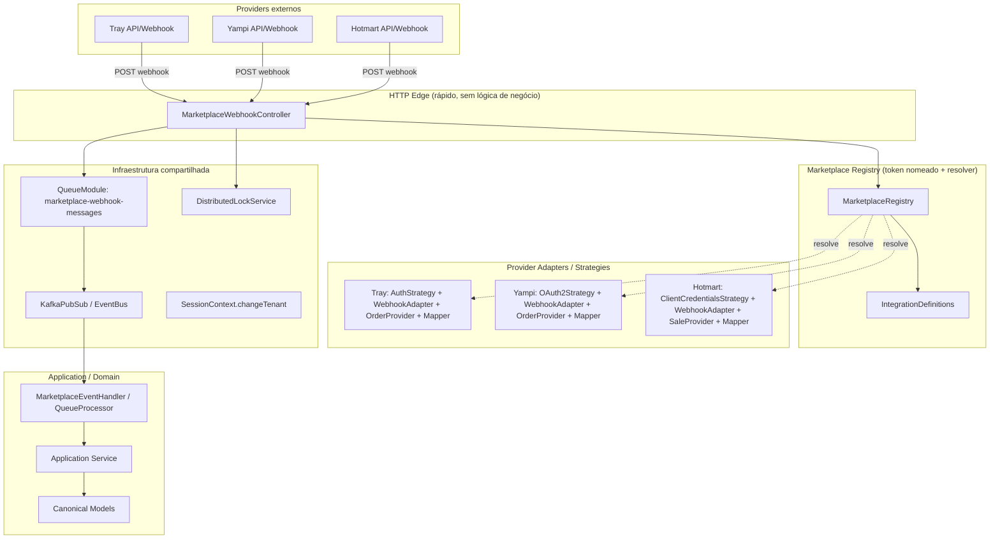

# Marketplace — Módulo de Integrações Reutilizável (Arquitetura DataCrazy)

> Documento arquitetural, não um tutorial. Os trechos TypeScript são **contratos conceituais** (formato de interfaces/abstrações), baseados em padrões que **já existem e são usados em produção** no DataCrazy — não em abstrações inventadas para este projeto. A regra de ouro: *antes de criar qualquer abstração nova, procure o padrão equivalente que já roda no monorepo e reuse*.
>
> Referências usadas: `datacrazy-services/libs/*`, `datacrazy-services/src/services/crm/src/modules/integrations`, `datacrazy-services/src/services/messaging/src/modules/{engines,instances,universal-connection}`, `libs/events/ecommerce/ecommerce-webhook.event.ts`.

---

## 0. Diagnóstico: o que já existe no DataCrazy e o que precisa ser criado

Antes de desenhar, vale separar o que **não é trabalho novo** — porque o monorepo já resolve — do que **é trabalho novo** de verdade.

| Tema | Já existe no DataCrazy | Precisa ser criado |
|---|---|---|
| Provider pluggable / registry por token | ✅ CRM `"INTEGRATIONS"` (array `integrations`) e messaging `"CHAT_SERVICES"`/`"CONTACT_SERVICES"`/`"CONFIGURATION_SERVICES"` + resolvers (`engines.providers.module.ts`) | Nada — só replicar o padrão no marketplace |
| Entidade persistida por tenant com `type`/`providerId`/`fields` | ✅ CRM `Integration` (domain) e `Instance` (messaging) | Evoluir para `IntegrationDefinition` (estático) × `IntegrationInstance` (tenant) |
| Webhook público seguro (assinatura + throttle + troca de tenant) | ✅ Padrão `@Public()` + `@WebhookThrottler()` + `SessionContext.changeTenant()` em todos os providers (tray, api4com, wavoip, whatsapp-cloud, universal...) | Nada — copiar o esqueleto |
| Consumidor cross-service de evento externo | ✅ `EcommerceWebhookKafkaEvent` + `@KafkaTopic` + `EventHandler` (tray → flow trigger via `TrayIntegrationEventHandler`) | Reusar, criando os eventos do marketplace |
| Filas com contexto de sessão restaurado | ✅ `QueueModule.registerQueue` + `registerProcessor`, `QueueProcessor` (restaura `sessionContext` de `QueueData`) | Nada |
| Lock distribuído / idempotência | ✅ `DistributedLockService.executeWithLock` (chave prefixada por tenant), idempotência/dedup no `QueueManager` | Porta de `IdempotencyStore` de longa duração se precisar de TTL > fila |
| Criptografia de credenciais | ✅ `CryptoHelpers.encrypt/decrypt` (AES-256-CBC) | **Porta `CredentialVault`** para isolar quem guarda o quê |
| Auth genérico (OAuth2/ApiKey/... reutilizável entre providers) | ❌ OAuth vive duplicado em `tray-authenticator.service.ts` e `whatsapp-cloud.auth.controller.ts` | **Strategies genéricas** em `libs/shared` (seção 11) |
| Integração "genérica config-driven" | ✅ `universal-connection` (config declarativa `send`/`receive`/`auth`/`credentials`) | Referência para o "conector genérico" do marketplace |
| Mapeamento canônico (Order/Customer/Product) | ❌ Nenhum canonical model cross-provider | Ícone central do marketplace (seção 13) |
| Catálogo/definição estática de provider | ✅ nenhum (só `types.enum.ts` com 5 tipos) | **`IntegrationDefinition` + `CapabilitySet`** (seção 4) |

**A decisão arquitetural mais importante deste documento:** o marketplace não deve desenhar um "framework de integrações" do zero. Ele deve **promover a abstração que já existe no CRM (`IntegrationService`/`IntegrationWebhookService`/`IntegrationResolver`)** para o nível de *definition/capability*, e **plagiar o registry por token nomeado do messaging** — isso é o esqueleto do que você quer. O resto é encaixar as peças compartilhadas já prontas.

---

## 1. O modelo mental do marketplace (três eixos ortogonais)

Nunca misture os três em uma única hierarquia de classes (é o erro clássico que gera `EcommerceIntegrationWithoutRefundsBase`):

1. **Type / Domínio** — classificação de negócio (`ECOMMERCE`, `INFOPRODUTO`, `CRM`, `PAYMENT`, `SHIPPING`...). Não implica comportamento técnico.
2. **Provider** — quem implementa capabilities concretas (`tray`, `yampi`, `hotmart`, `shopify`...). É o ponto de composição.
3. **Capability** — comportamento reutilizável e opcional (`AUTH`, `WEBHOOK`, `ORDERS`, `PRODUCTS`, `CUSTOMERS`, `REFUNDS`, `SALES`...). É o que o core consome via **porta tipada**, nunca via `providerId`.

O core do marketplace **nunca** pergunta "quem é o provider" para decidir comportamento. Ele pergunta "esse provider tem a capability X?" e, se sim, invoca a porta correspondente. Quem sabe que `tray` ↔ implementação concreta de `OrderCapability` é **exclusivamente o Registry** — o mesmo raciocínio dos resolvers `ChatServicesResolver`/`IntegrationResolver` que já existem.

> No DataCrazy isso já está meio feito em duas versões imperfeitas:
> - CRM (`integrations`) chegou em **type estruturado** (`IntegrationService.type` + array `integrations` + `IntegrationResolver`), mas sem capabilities — o `IntegrationWebhookService` está em outro array, desconectado do `IntegrationService`.
> - Messaging (`engines`) chegou em **registry por token nomeado** (`"CHAT_SERVICES"` + resolvers), mas o "type" é o provider em si, sem domínio.
>
> O marketplace é a oportunidade de fazer **um** padrão completo: capability composta dentro da definition, um só registry.

---

## 2. Camadas (Dependency Inversion — como já é no monorepo)

```
┌──────────────────────────────────────────────────────────────┐
│ libs/shared (KafkaPubSub, QueueModule, DistributedLock,      │
│              SessionContext, PrismaRepository, guards,       │
│              CryptoHelpers, MicroserviceClient)              │
│  ┌────────────────────────────────────────────────────────┐  │
│  │ Marketplace Core (REGISTRY + ports/capabilities +      │ │
│  │              envelope)                                  │ │
│  │   ┌──────────────────────────────────────────────────┐ │  │
│  │   │ Providers (tray, yampi, hotmart...)               │ │ │
│  │   │   └── Adapters/Strategies (auth, webhook, mapper)│ │ │
│  │   └──────────────────────────────────────────────────┘ │  │
│  └────────────────────────────────────────────────────────┘  │
└──────────────────────────────────────────────────────────────┘
```

Regra de import (idêntica à que o monorepo já respeita): o **core nunca importa provider**. A dependência é sempre `ProviderModule → CoreModule` (via `DataCrazyAppModule`/`DataCrazyModule`), nunca o inverso. O registry não conhece Tray — conhece a interface `IntegrationDefinition`.

### Onde cada peça compartilhada entra

| Peça do marketplace | Infra DataCrazy que implementa |
|---|---|
| Registry + resolvers | `IntegrationResolver` (CRM), resolvers do messaging — mesmo `useFactory(...services[]) => services` + token nomeado |
| Publicação de eventos | `EventsPubSub.publish()` / `KafkaPubSub` — já injeta `event["sessionContext"]` |
| Consumer | `@KafkaTopic({ pool: { concurrency } })` + `EventHandler` (restaura sessão + retry 3) |
| Filas de processamento pesado | `QueueModule.registerQueue("nome")` + `registerProcessor(SeuProcessor)` (**as duas chamadas, não esquecer**) |
| Idempotência do webhook | `DistributedLockService.executeWithLock` com `eventId`/`externalEventId` como chave + dedup do `QueueManager` |
| Troca de tenant em webhook/consumer | `SessionContext.changeTenant(tenantId, ...)` — obrigatório em todo entrypoint público |
| Persistência tenant-scoped | `PrismaRepository` (fixedWhere `{tenantId, deletedAt:null}`) |
| Criptografia | `CryptoHelpers.encrypt/decrypt` (AES-256-CBC, `CRYPTO_SECRET_KEY`) |
| Guards de rota | `@Public()` + `@WebhookThrottler()` + `@Roles`, `@PlanNotFree` |
| Contratos cross-service | `DomainEvent`/`DomainRequest` em `libs/events`, `@MicroserviceRequestHandler` |

---

## 3. Diagrama geral (Mermaid)



---

## 4. `IntegrationDefinition` (estático, sem tenant) × `IntegrationInstance` (tenant)

Essa dupla é a evolução do que já existe:

- O CRM tem `Integration` (persistida, com tenant — papel de **Instance**) mas não tem a **Definition** (o "catálogo": o que o provider *sabe fazer*).
- O messaging tem `Instance` (provider/engine/config — papel de **Instance**), e o "catálogo" é apenas o array de providers no `engines.providers.module.ts`.

```typescript
// core/capabilities/capability-set.ts
export type CapabilitySet = {
  auth?: AuthenticationStrategy;          // presença = suporte (porta tipada, não flag)
  webhook?: WebhookCapability;
  orders?: OrderCapability;
  products?: ProductCapability;
  customers?: CustomerCapability;
  sales?: SaleCapability;                 // infoproduto
  shipments?: ShipmentCapability;          // extensível SEM alterar o core
  // cada capability é um campo opcional — novo provider só preenche o que tem
};

// core/domain/integration-definition.ts
export class IntegrationDefinition {
  readonly providerId: string;            // 'tray'
  readonly type: IntegrationType;         // ECOMMERCE
  readonly displayName: string;
  readonly capabilities: CapabilitySet;
}
```

**Por que `CapabilitySet` objeto e não `capabilities: string[]`?**
Porque enum array te obriga a `registry.getCapability(provider, 'ORDERS') as OrderCapability` — cast inseguro, o famoso `if/switch` disfarçado. Com `CapabilitySet`, `definition.capabilities.orders` já é `OrderCapability | undefined`, checável com type guard e sem cast. É o mesmo raciocínio que motivou o `types.enum.ts` do CRM, mas levado ao tipo da *implementação*, não ao rótulo.

**`IntegrationInstance`** — continue seguindo o modelo do messaging `Instance`:

```typescript
export class IntegrationInstance {
  id: string;
  tenantId: string;                       // preenchido pelo PrismaRepository/MongoRepository
  providerId: string;
  credentialsRef: string;                 // ponteiro p/ vault — CriptoHelpers na porta, nunca cru no domínio
  config: Record<string, unknown>;        // { storeId, environment: 'production' }
  status: 'ACTIVE' | 'DISABLED' | 'ERROR';
}
```

Definition = **comportamento** (singleton, injetado via DI no bootstrap do módulo).
Instance = **dado de configuração** (linha de banco, carregada por repositório).
Nunca misture os dois numa entidade única com estado de tenant embutido.

---

## 5. Registry — o padrão que você já usa (token nomeado + resolver)

No DataCrazy, registry **não é** `Map` populado em `onModuleInit` — é a combinação de **token nomeado + `useFactory` de array + resolver** (megje `engines.providers.module.ts` e `integrations/integration.module.ts`). Replicar isso é a escolha certa, porque é o padrão que o time já entende e testa:

```typescript
// marketplace.providers.module.ts
@Module({ /* imports: DataCrazyModule, ... */ })
export class MarketplaceProvidersModule {
  // Existem N implementações de IntegrationDefinition sob o mesmo token "INTEGRATIONS_MARKETPLACE"
}
```

```typescript
// core/registry/marketplace.registry.ts
@Injectable()
export class MarketplaceRegistry {
  // injetado via @Inject("INTEGRATIONS_MARKETPLACE")
  constructor(private readonly definitions: IntegrationDefinition[]) {}

  get(type: IntegrationType, providerId: string): IntegrationDefinition {
    const def = this.definitions.find(
      (d) => d.type === type && d.providerId === providerId,
    );
    if (!def) throw new IntegrationNotFoundException(type, providerId);
    return def;
  }

  listByType(type: IntegrationType): IntegrationDefinition[] {
    return this.definitions.filter((d) => d.type === type);
  }
}
```

**`(type, providerId)` como chave composta** é decisão de design, não capricho: particiona o namespace por domínio (autorização "este tenant só habilita ECOMMERCE"), facilita roteamento de webhook e evita colisão de nome comercial entre domínios. Trate como value object `IntegrationKey`, nunca string concatenada manualmente.

**Como adicionar um novo provider SEM tocar no core:**

1. Criar `providers/<novo>/` com o módulo + capabilities que fizerem sentido.
2. Adicionar a classe ao array do módulo provisionado pelo token `"INTEGRATIONS_MARKETPLACE"` (ex.: `const marketplaceIntegrations = [TrayIntegrationDefinition, YampiIntegrationDefinition, ...]` seguindo a convenção de `integrations` do CRM).
3. Registrar o controller de webhook do provider em `MarketplaceWebhookController` — ou, melhor, um controller genérico que resolve via Registry (seção 8).
4. **Zero linhas alteradas** em Registry, core, publisher, consumers.
5. Se o provider tiver `eventType` novo sem handler, cai em `UnknownEventTypeException` → DLQ, sem quebrar ninguém (seguro por default).

> **Trade-off vs. autorregistro via `onModuleInit`:** o padrão de array explícito do monorepo é melhor aqui — quem esquece de importar o módulo quebra em *compile-type*/*teste de integração*, não em runtime, e é consistente com `registerQueue`+`registerProcessor`. Mitigue com um teste que compara `registry.listByType()` contra uma lista esperada.

---

## 6. Modelo de dados (Prisma, seguindo o CRM)

```prisma
model MarketplaceIntegrationDefinition {
  id          String   @id @default(uuid())
  providerId  String
  type        String
  displayName String
  capabilities Json     // snapshot pg para o catálogo (UI/admin); o comportamento é código
  @@unique([type, providerId])
}

model MarketplaceIntegration {
  id            String  @id @default(uuid())
  tenantId      String
  definitionRef String  // "ECOMMERCE:tray"
  credentialsRef String
  config        Json    @default("{}")
  status        String  @default("ACTIVE")
  @@index([tenantId, definitionRef])
}
```

**Regras do monorepo que se aplicam aqui:**
- `snake_case` com `@@map`/`@map`, `deletedAt` para soft-delete, ids uuid UI (convenção do `schema.prisma` do accounts/crm).
- Repositório estende `PrismaRepository` — o `fixedWhere()` já força `{ tenantId, deletedAt: null }` e lança `InvalidTenantException` sem tenant.
- Unsafe (`*UnsafeRepository`) **só** para o roteamento de webhook público (achar a instância do provider por `providerId`/`storeId` antes de ter tenant) — literalmente o que `findUnsafeInstancesByUserIdAndProvider` do messaging faz.

---

## 7. Envelope de eventos — adaptação do modelo DataCrazy

O DataCrazy **não** tem um `IntegrationEvent<T>` genérico no padrão do documento original; o padrão real é `DomainEvent` + payload tipado + `@KafkaTopic` (`EcommerceWebhookKafkaEvent` é o exemplo). Recomendação: **adotar um envelope de integração explícito** em `libs/events/marketplace/`, porque o payload cru do provider + metadados de observabilidade não cabem bem no `DomainEvent` raquítico de hoje:

```typescript
// libs/events/marketplace/marketplace-webhook.event.ts
export const MARKETPLACE_WEBHOOK_TOPIC = "marketplace.webhook.received";

@KafkaTopic({ pool: { concurrency: 5 } })
export class MarketplaceWebhookKafkaEvent extends DomainEvent {
  constructor(public readonly data: MarketplaceWebhookEnvelope) {
    super(data);
  }
}

export interface MarketplaceWebhookEnvelope {
  eventId: string;
  eventType: string;              // canônico: 'ecommerce.order.created' (não o nome cru do provider)
  version: number;                // versão do envelope, não do payload
  tenantId: string;
  integrationType: IntegrationType;
  providerId: string;
  correlationId: string;
  causationId?: string;
  idempotencyKey: string;         // hash determinístico (providerId + externalEventId)
  occurredAt: string;             // quando aconteceu no provider
  receivedAt: string;             // quando a plataforma recebeu
  metadata: {
    schemaVersion: number;
    traceId?: string;
    retryCount?: number;
    rawPayloadRef?: string;       // blob store, nunca JSON gigante na mensagem
  };
  payload: Record<string, unknown>; // tipado por evento no consumer
}

export function createMarketplaceWebhookEvent(
  payload: MarketplaceWebhookEnvelope,
): MarketplaceWebhookKafkaEvent {
  return new MarketplaceWebhookKafkaEvent(payload);
}
```

Pontos que a experiência DataCrazy valida:
- **`correlationId`/`causationId`**: cobrem a cadeia webhook → order.created → flow trigger (exatamente o caminho `EcommerceWebhookKafkaEvent` → `TrayIntegrationEventHandler` → `TrayIntegrationTrigger`).
- **`idempotencyKey` determinística**: reprocessar o mesmo webhook do provider (retry) gera a **mesma** chave — senão a idempotência não funciona. Compõe com `DistributedLockService.executeWithLock(idempotencyKey)` no consumer e com o dedup do `QueueManager`.
- **`sessionContext`**: o `EventsPubSub.publish()` injeta `event["sessionContext"]` automaticamente — o consumer restaura via `EventHandler`. Mantenha `sessionContext` fora do `data` tipado; ele é infraestrutura do barramento.

**Tópicos** (dois níveis, granularidade `domain.resource.event`, nunca por provider):

```
marketplace.webhook.received                  # entrada crua (opcional; só se o parsing for pesado)
marketplace.ecommerce.order.created
marketplace.ecommerce.order.updated
marketplace.ecommerce.customer.created
marketplace.infoproduct.sale.created
marketplace.infoproduct.subscription.cancelled
marketplace.payment.charge.succeeded
```

- Particionar por `tenantId` (ordering por tenant garantido — é o que importa). Nunca por `eventId` nem por `providerId`.
- Consumer groups por responsabilidade de negócio (`order-sync-service`, `notification-service`), não por provider.
- Retry local (padrão `EventHandler`, 3 tentativas) → DLQ após exceder (padrão `dead.letter.event.ts`/`failed-event-recovery`).
- Evolução: `metadata.schemaVersion`; mudança aditiva não incrementa, breaking exige versão nova.

---

## 8. Arquitetura de Webhook (o padrão que o monorepo já repete em N providers)

O esqueleto de todo webhook público do DataCrazy é o mesmo; o marketplace deve **copiá-lo**, não reinventar:

```typescript
abstract class WebhookAdapter<TRaw = unknown> {
  abstract verifySignature(req: RawWebhookRequest): boolean;      // timingSafeEqual/HMAC — varia por provider
  abstract parse(req: RawWebhookRequest): TRaw;
  abstract identifyEventType(payload: TRaw): string;              // 'novo_pedido' → 'order.created'
  abstract extractIdempotencyKey(payload: TRaw): string;
  abstract toEnvelopePayload(payload: TRaw): unknown;             // normalização mínima, NÃO mapeamento completo
}
```

Controller genérico (rota por domínio, loga cada passo em `IntegrationLog` — como o CRM faz):

```typescript
@Controller("webhooks/:integrationType/:providerId")  // fora do prefixo? ver main.ts
export class MarketplaceWebhookController {
  // @Public() + @WebhookThrottler() — como todo webhook do monorepo
  constructor(
    private readonly registry: MarketplaceRegistry,
    private readonly lock: DistributedLockService,
    private readonly logRepository: IntegrationLogRepository,   // ou no handler
  ) {}

  @Post()
  async receive(
    @Param("integrationType") type: IntegrationType,
    @Param("providerId") providerId: string,
    @Req() req: RawWebhookRequest,
  ) {
    const def = this.registry.get(type, providerId);
    const webhook = def.capabilities.webhook;
    if (!webhook) throw new NotFoundException();

    if (!webhook.adapter.verifySignature(req)) throw new UnauthorizedException();

    const raw = webhook.adapter.parse(req);
    const idempotencyKey = webhook.adapter.extractIdempotencyKey(raw);

    // achar o tenant: via identificador na URL (:tenantId) ou correlação
    // payload→instância (findUnsafeInstancesByUserIdAndProvider do messaging)
    return this.lock.executeWithLock(idempotencyKey, () =>
      this.enqueue(envelope, raw),
    );
    // retorna 200 idempotente se já processado
  }
}
```

**Pipeline extremamente importante — o que NÃO fazer no path HTTP (meta p99 < 100ms):**
- Não mapear para canonical model aqui. O que sai do HTTP é o payload **cru/levemente normalizado** dentro do envelope. Mapeamento completo é assíncrono, no consumer, retry-ável.
- Não chamar API externa no HTTP path.
- Verificação de assinatura falhou → **não publica, não enfileira** → `401`.
- Redis/lock indisponível → `503` e o provider fará retry.

O XML/JSON assinatura detalhada de cada provider (a assinatura secreta no header `X-Signature`, token estático, HMAC-SHA256) é **implementação do adapter** — o pipeline é compartilhado; só o `verifySignature`/`parse` varia. O `universal-connection` já é um exemplo de provider que faz esse pipeline **config-driven** (`receive.signatureHeader + algorithm sha256/sha1/hmac-sha256/static`) — pode ser a base do "conector genérico" do marketplace (seção 14).

---

## 9. Consumidor do marketplace (filas + eventos)

Dois mecanismos do monorepo se encaixam aqui, por throughput e criticidade:

1. **Envelope leve → Kafka** (`MarketplaceWebhookKafkaEvent`): para eventos tipados que outros microserviços consomem (flow do CRM se inscreve em `marketplace.ecommerce.order.created`).
2. **Processamento pesado/retry-ável → BullMQ** (`QueueModule.registerQueue("marketplace-webhook-messages")` + `registerProcessor(SeuProcessor)`): para mapear canonical model, persistir, notificar — com `QueueProcessor` restaurando `sessionContext` de `QueueData`.

```typescript
// processor
@Processor("marketplace-webhook-messages", { concurrency: 10 })
export class MarketplaceWebhookProcessor extends QueueProcessor<MarketplaceWebhookEnvelope> {
  // QueueProcessor já restaura o context de sessão do job.data.sessionContext
  async execute(data: MarketplaceWebhookEnvelope): Promise<void> {
    await this.lock.executeWithLock(data.idempotencyKey, () =>
      this.handler.handle(data),
    );
  }
}
```

Tudo que o consumer precisa já vem no envelope (`tenantId`, `integrationType`, `providerId`, `eventType`) — igual o `EventHandler` do CRM resolve `EcommerceWebhookKafkaEvent` → `TrayIntegrationTrigger`.

---

## 10. Idempotência — sem reinventar

Hoje o monorepo tem idempotência **de curta duração** embutida (`QueueManager` dedup + lock `executeWithLock`). Para webhook/evento de marketplace, a recomendação é:

- **Camada 1 (HTTP):** `executeWithLock("webhook:" + idempotencyKey, ...)` — não republica/enfileira o mesmo webhook.
- **Camada 2 (consumer):** lock + checar "já processado" na aplicação, porque Kafka/filas garantem *at-least-once*, não *exactly-once*. Uma column `processedKey`/marcador na `IntegrationLog` serve (ou `markProcessed` com TTL num `IdempotencyStore` se o volume justificar).

Não crie um framework de idempotência; **crie a porta** (`abstract IdempotencyStore`) e deixe a implementação seguir em `KafkaIdempotencyStore`/prisma como *infra* — exatamente o estilo `IdempotencyStore` do documento original, mas plugado no `DistributedLockService` que já existe.

---

## 11. Autenticação — por Strategy (composição), não herança

Hoje o OAuth vive **duplicado** (tray, whatsapp-cloud, facebook-leadgen, google-calendar). O marketplace paga esse débito promovendo strategies genéricas para `libs/shared`:

```typescript
// libs/shared/src/integration-auth/strategies/authentication.strategy.ts
export abstract class AuthenticationStrategy {
  abstract getAuthorizationHeaders(instance: IntegrationInstance): Promise<Record<string, string>>;
  abstract refresh?(instance: IntegrationInstance): Promise<CredentialSet>;
}

// strategies concretas, reutilizáveis entre providers
export class OAuth2Strategy extends AuthenticationStrategy { /* config: authorizationUrl, tokenUrl, clientId, clientSecret, scopes */ }
export class OAuth2PkceStrategy extends AuthenticationStrategy {}
export class ApiKeyStrategy extends AuthenticationStrategy {}
export class ClientCredentialsStrategy extends AuthenticationStrategy {}
export class BasicAuthStrategy extends AuthenticationStrategy {}
```

- Yampi e Shopify usam **a mesma** `OAuth2Strategy`, configurada diferente (`useFactory` a partir do módulo do provider) — zero código novo de auth.
- Provider com fluxo proprietário (HMAC custom) → implementa `AuthenticationStrategy` propria, sem nova abstração no core.
- **Refresh automático de token** no provider (tray já faz: `TrayAuthenticatorService` + `ExecuteWithFreshTokenCommandHandler`) é candidato a virar **core reutilizável**: um interceptor/"fresh-token" executor compartilhado, não reimplementado por provider.
- **Credenciais** criptografadas com `CryptoHelpers` e guardadas via uma **porta `CredentialVault`** (hoje o acesso é espalhado em cache/fields). A strategy pede credenciais, não as persiste.

---

## 12. Capabilities — par (porta tipada, implementação opcional)

```typescript
// core/capabilities/order-capability.ts
export abstract class OrderCapability {
  abstract getOrder(instance: IntegrationInstance, externalId: string): Promise<CanonicalOrder>;
  abstract listOrders(instance: IntegrationInstance, filter: OrderFilter): Promise<Page<CanonicalOrder>>;
}

// core/capabilities/webhook-capability.ts
export abstract class WebhookCapability {
  abstract adapter: WebhookAdapter;
  abstract getEventHandler(eventType: string): EventHandler | undefined;
}
```

Capability **não é herança nem enum flag** — é presença opcional num slot tipado do `CapabilitySet`. Quem não suporta `refunds` simplesmente não preenche o slot; o consumidor faz `if (def.capabilities.refunds) {...}` — igual ao messaging decide "qual engine" via resolver, mas com tipo garantido pelo compilador.

---

## 13. Canonical Models — o item de maior valor do marketplace

**Quando criar:** o recurso é (a) consultado/cruzado por consumers agnósticos a provider (dashboard financeiro somando `Order.total` de Tray + Yampi), ou (b) publicado como evento que outros serviços consomem sem saber a origem.

**Quando NÃO criar:** dados que só fazem sentido no fluxo do provider e nunca são cruzados — deixe no payload cru, no `providerData`, não force campo canônico vazio.

**Onde fica o mapping:** no **Mapper do provider** (`tray-order.mapper.ts`), parte do módulo do provider, invocado pelo handler genérico — nunca no core. O core só define o shape do contrato.

```typescript
// ecommerce/domain/canonical-order.ts
export interface CanonicalOrder {
  externalId: string;
  tenantId: string;
  providerId: string;
  status: CanonicalOrderStatus;       // enum canônico com mapeamento de status por provider
  total: Money;
  items: CanonicalOrderItem[];
  customer: CanonicalCustomerRef;
  createdAt: Date;
  updatedAt: Date;
  providerData?: unknown;             // escape hatch explícito, tipado no adapter do provider
}
```

`providerData` é o antídoto contra o "lowest common denominator": o modelo carrega o que tem equivalência semântica real; o resto fica acessível, mas fora do contrato. E o erro de "forçar Hotmart sale virar Order" é o mesmo de sempre: são **dois domínios** (`CanonicalSale` com comissão de afiliado ≠ `CanonicalOrder`), com modelos canônicos próprios — não force um modelo único.

---

## 14. O "conector genérico" — herança do `universal-connection`, não um DSL novo

O messaging já tem o blueprint do conector universal: `UniversalConnectionConfig { send, receive, auth, credentials }` — endpoints declarativos, `responseMapping`, `retry`, validação de assinatura configurável, log completo de request/response com mascaramento de header.

Para o marketplace, o movimento certo é:

- **Não fazer** um "GenericProvider universal" que tenta REST/GraphQL/SOAP/polling ao mesmo tempo.
- **Fazer** o provider genérico apenas para o *perfil de integração* mais comum (webhook de eventos + fetch por API de recurso com auth padronizado), **config-driven** como o universal-connection — útil para o "long tail" de integrações que um parceiro liga sem escrever código.
- Todo resto continua com `ApiClient` próprio por provider sobre o `HttpModule` compartilhado (retry/circuit-breaker/refresh de token).

Regra prática: **construa a abstração config-driven depois de ver o padrão se repetir 3x**, não antes (o próprio universal-connection só nasceu depois de N providers de mensageria).

---

## 15. Estrutura de módulos proposta (no novo microserviço `marketplace`)

Convenção `domain/ application/ infra/` + registro centralizado (padrão CRM/AGENTS.md):

```
src/
  marketplace/
    core/                                    # NUNCA importa provider
      registry/
        marketplace.registry.ts
        integration-key.ts
        integration-not-found.exception.ts
      capabilities/
        order-capability.ts
        webhook-capability.ts
        product-capability.ts
        customer-capability.ts
        sale-capability.ts
        auth-capability.ts                   # abstract AuthenticationStrategy
      events/
        marketplace.envelope.ts
        idempotency-store.port.ts            # implementação: DistributedLockService/prisma
      credentials/
        credential-vault.port.ts             # implementação: CryptoHelpers + fields/cache
      marketplace-core.module.ts             # @Global() via DataCrazyModule pattern

    ecommerce/
      domain/ canonical-order.ts canonical-customer.ts canonical-product.ts
      application/ order-event.handler.ts ecommerce-integration.module.ts
      providers/
        tray/
          tray.module.ts
          tray.definition.ts                 # monta CapabilitySet + registry token
          tray.auth.strategy.ts              # OAuth2Strategy configurada
          tray.webhook.adapter.ts
          tray.order.provider.ts
          tray.order.mapper.ts
          tray.api.client.ts
        yampi/ ...
    infoproduct/
      domain/ canonical-sale.ts
      application/ sale-event.handler.ts infoproduct-integration.module.ts
      providers/hotmart/ ...

  marketplace.module.ts                      # agrega, importa DataCrazyAppModule.forRoot(...)
```

**Rules de import (inversão de dependência aplicada a módulos):**

```
MarketplaceCoreModule            ← não importa nada de providers/domínios
TrayIntegrationModule            → importa MarketplaceCoreModule, libs/shared (auth/queue/lock)
YampiIntegrationModule           → idem
HotmartIntegrationModule         → idem
EcommerceIntegrationModule       → importa Tray/Yampi + core webhook module
InfoproductIntegrationModule     → importa Hotmart
MarketplaceModule (raiz)         → importa os domínios + DataCrazyAppModule.forRoot(...)
```

Nunca o inverso. Essa é a regra que mantém o core "surdo" a providers e garante que a 10ª integração seja mais rápida que a 1ª.

---

## 16. Playbook — adicionar uma nova integração

1. Criar `providers/<novo>/module.ts` + `definition` + `*.auth.*` (reutilizando uma strategy `libs/shared` sempre que possível) + `*.webhook.adapter.*` + `*.<resource>.provider.*` + `*.mapper.*` + `*.api.client.*`.
2. Implementar **só** o específico: assinatura, parsing, mapeamento → canonical, chamadas de API.
3. Adicionar a classe ao array do token `"INTEGRATIONS_MARKETPLACE"` (e o webhook à rota/controller correto do domínio).
4. Importar o módulo no módulo de domínio (`EcommerceIntegrationModule`) — ou criar um domínio novo.
5. **Nenhuma alteração** em: Registry, core, envelope, controllers genéricos, queues, outros providers.
6. `eventType` novo sem handler → `UnknownEventTypeException` → DLQ (seguro por default).

Critério de sucesso: a partir da 3ª/4ª integração, só o passo 2 consome tempo; o resto é mecânico.

---

## 17. O que NÃO abstrair no core

- Mapeamento provider → canonical (é específico por definição).
- Verificação de assinatura de webhook (algoritmo varia por provider).
- Regras de negócio de domínio (ficam em Application/Domain).
- DSL de mapeamento config-driven key por JSON **antes** de 5+ casos reais.
- `GenericProvider` universal (REST+GraphQL+SOAP+polling).
- Herança entre domínios. Herança só faz sentido *dentro* do mesmo provider (`TrayApiClient extends BaseHttpClient`).

**Composição é a regra; herança, exceção pontual.**

---

## 18. Trade-offs aceitos (assinados)

- **`(type, providerId)` composta:** mais verboso, paga em autorização e organização de módulo. Aceito.
- **Envelope com `correlationId`/`causationId`/metadados:** mais campos, porém essenciais em produção para debug distribuído. Aceito.
- **Canonical model com `providerData` escape hatch:** menos "puro", evita perda de dado. Aceito.
- **Registry por token nomeado + array explícito (em vez de self-registration `onModuleInit`):** consistente com o monorepo e pegável em compile-type. Aceito.
- **Mapeamento completo fora do HTTP path:** latência e acoplamento vão para o consumer assíncrono retry-ável. Aceito.
- **Conector genérico só para o perfil comum:** cobre o long tail sem puxar um framework universal. Aceito.

---

## 19. Critérios de sucesso / o que medir

- **Tempo de um novo provider:** métrica de processo (ex.: P50 < X dias da 5ª integração em diante).
- **Linhas tocadas no core por integração nova:** deve ser `0` (guard em CI).
- **Testes de contrato por provider:** `registry.get(type, id)` retorna as capabilities esperadas; `mapper.toCanonical(fixture)` bate com snapshot — rodando isoladamente, sem entender os outros 19 (é isso que garante a 20ª integração barata).
- **Webhook HTTP no SLA:** p99 < 100ms, nada de chamada externa no path.
- **Sem `if (providerId === 'tray')`** fora do módulo do provider (grep como alerta de regressão).
