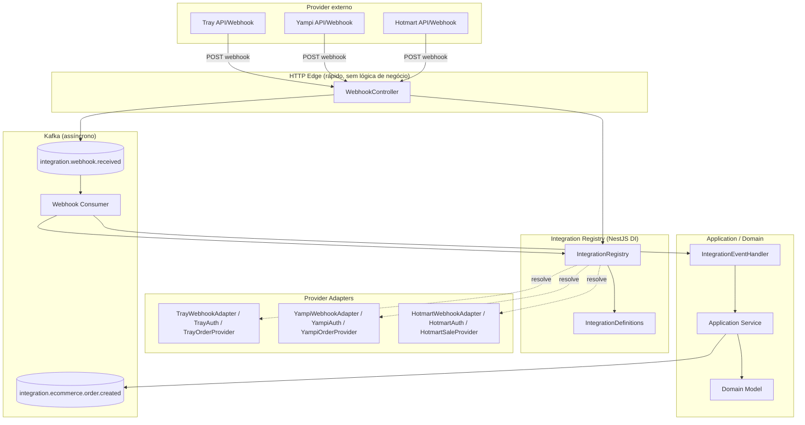
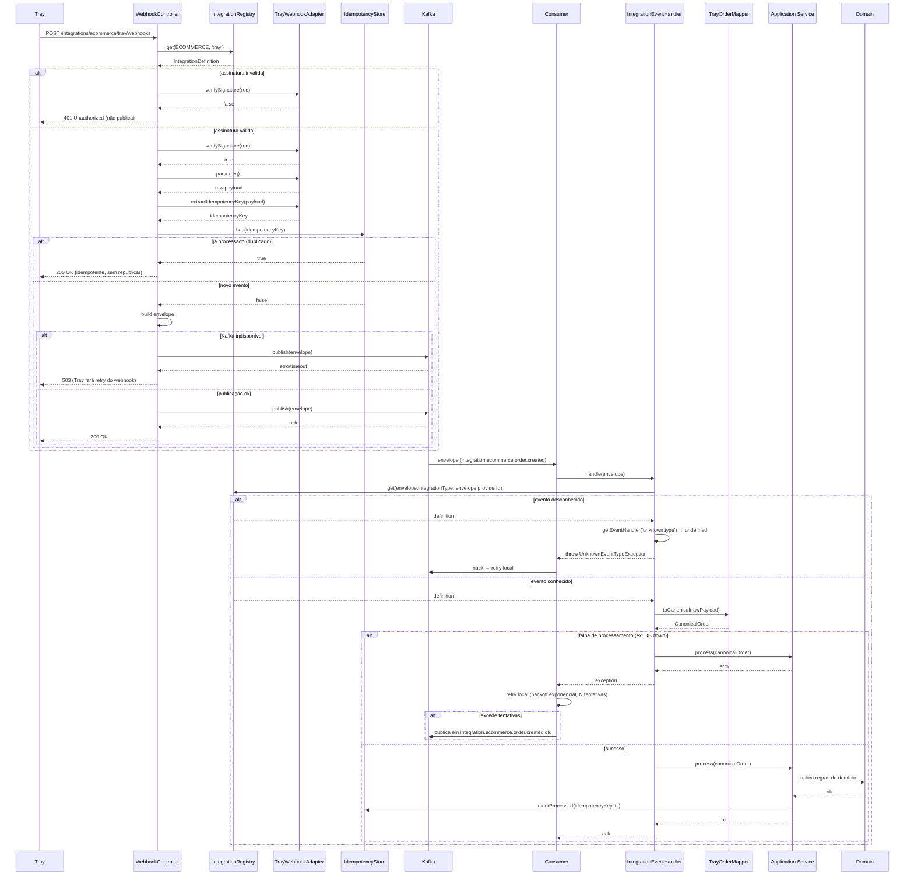
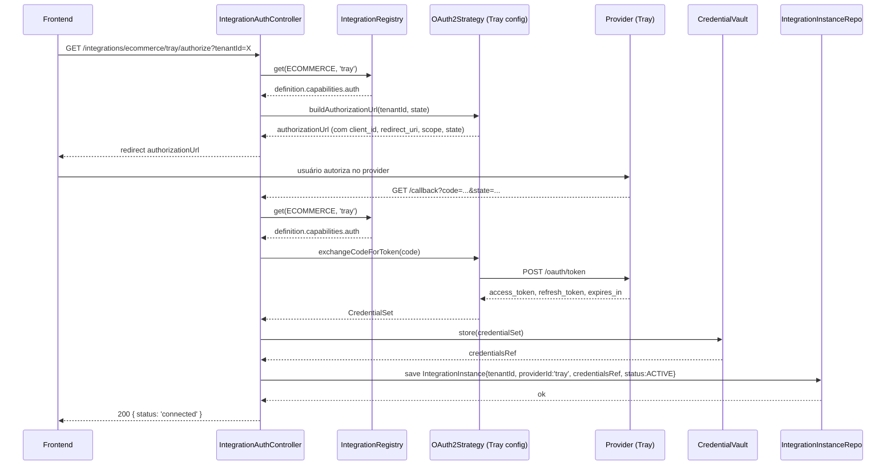

# Integration Platform — Arquitetura Técnica (NestJS)

> Documento arquitetural crítico, não um tutorial de código. Os trechos TypeScript são **contratos conceituais** (assinaturas de interfaces/abstrações), não implementação completa. O objetivo é decidir a forma antes de escrever a primeira linha de produção.

---

## 0. Diagnóstico crítico do que você propôs

Antes de desenhar a arquitetura "certa", vale confrontar diretamente as premissas do enunciado — porque várias delas estão corretas, mas incompletas ou perigosas se levadas ao pé da letra.

**`IntegrationDefinition { providerId, type, capabilities }` — está incompleta, não errada.**
Essa modelagem é o ponto de partida certo, mas se `capabilities` for só uma lista de enums (`['AUTH','WEBHOOK','ORDERS']`), você recria o problema que está tentando evitar: em algum lugar vai existir um `if (capabilities.includes('ORDERS'))` seguido de um cast inseguro para pegar a implementação. Capability precisa ser **um objeto tipado que carrega a implementação**, não uma flag. Detalho isso na seção 14.

**`providerId + integrationType` como chave de resolução — correta, e deve ser respeitada como composta, nunca "achatada".**
A tentação natural é usar só `providerId` como chave global (é único na prática: `tray`, `yampi`, `hotmart` nunca colidem). Mas resolver por chave composta `(type, providerId)` é uma decisão de design, não uma necessidade técnica imediata — e ela paga dividendos: (1) o namespace do registry fica particionado por domínio, o que facilita autorização ("este tenant só pode habilitar integrações do tipo ECOMMERCE"), roteamento de webhook e organização de módulos; (2) evita colisão futura se dois domínios usarem o mesmo nome comercial (ex.: um "Stripe" genérico usado tanto em PAYMENT quanto embutido em outro domínio). Mantenha a chave composta.

**Kafka no core ou na infraestrutura? Infraestrutura, sem exceção.**
O *core* da plataforma não deve conhecer Kafka como conceito — deve conhecer uma **porta** (`EventPublisher`, `EventConsumer`) que a infraestrutura implementa com KafkaJS/`@nestjs/microservices`. Isso não é purismo: é o que permite trocar Kafka por SQS ou testar o pipeline de webhook inteiro em memória, sem broker, em CI. Detalho em 9 e 10.

**Webhook é capability? Sim, mas não é uma interface única — é um *bundle* de porta + implementação.**
"Webhook" não é um verbo único (`handle(payload)`). É um conjunto: verificação de assinatura, parsing, identificação de tipo de evento, normalização. Modelar como uma única interface gorda (`WebhookHandler.handle()`) empurra toda a lógica provider-specific para dentro de um método só, dificultando reuso do pipeline comum. Melhor: a capability "webhook" é satisfeita por um **adapter** que implementa passos pequenos e plugáveis num **pipeline genérico do core**. Seção 9.

**Authentication é capability? Sim, e deve ser modelada por composição de Strategy, não por herança de "tipos de integração autenticada".**
Nunca crie `OAuthIntegration extends BaseIntegration`. A integração *tem* uma estratégia de autenticação (composição), não *é* uma estratégia. Seção 13.

**Canonical models são adequados? Sim, mas só para os recursos que você vai efetivamente *consultar/cruzar* entre providers (Order, Customer, Product, Payment). Não force canonicalização de tudo.** Detalho o critério em 15 — o erro mais comum em plataformas de integração é o "lowest common denominator" que você já identificou como risco: um modelo canônico empobrecido que ninguém usa porque perdeu informação relevante do provider.

**Sua hierarquia de herança `BaseIntegration → EcommerceIntegration → TrayIntegration` está errada, e você mesmo já suspeitava.** Herança de domínio é o erro clássico de frameworks internos que “engessam” com o tempo: assim que a 6ª integração de e-commerce tiver uma capability que as outras 5 não têm, ou não tiver uma que as outras têm, a hierarquia quebra ou vira um `EcommerceIntegrationWithoutRefundsBase`. Composição resolve isso de forma natural (seção 26-27).

Com isso resolvido, seguimos para o desenho.

---

## 1. Arquitetura recomendada (visão geral)

Três eixos ortogonais, nunca misturados em uma única hierarquia de classes:

1. **Domain (IntegrationType)** — classificação de negócio (ECOMMERCE, INFOPRODUCT, CRM, PAYMENT...). Não implica comportamento técnico.
2. **Provider (providerId)** — quem implementa capabilities concretas para um domínio (`tray`, `yampi`, `hotmart`). É o ponto de composição.
3. **Capability** — comportamento reutilizável e opcional (`AUTH`, `WEBHOOK`, `ORDERS`, `PRODUCTS`, `CUSTOMERS`, `REFUNDS`...). É o que o *core* consome via porta/interface, nunca via `providerId`.

O core da plataforma **nunca** pergunta "quem é o provider" para decidir comportamento. Ele pergunta "esse provider tem a capability X?" e, se sim, invoca a porta correspondente. Quem sabe que "Tray" ↔ implementação concreta de `OrderReader` é exclusivamente o **Provider Registry**, construído via DI do NestJS.

Camadas (de dentro para fora, dependências sempre apontando para dentro — Dependency Inversion):

```
┌─────────────────────────────────────────────────────────┐
│ Infrastructure (Kafka, HTTP clients, DB, cron, signature)│
│   ┌─────────────────────────────────────────────────┐   │
│   │ Adapters (Provider-specific: Tray, Yampi, Hotmart)│  │
│   │   ┌───────────────────────────────────────────┐  │   │
│   │   │ Application (use cases, handlers, mappers) │  │   │
│   │   │   ┌─────────────────────────────────────┐  │  │   │
│   │   │   │ Domain (Order, Customer, eventos)   │  │  │   │
│   │   │   └─────────────────────────────────────┘  │  │   │
│   │   └───────────────────────────────────────────┘  │   │
│   └─────────────────────────────────────────────────┘   │
└─────────────────────────────────────────────────────────┘
```

Ports (interfaces) vivem no core/domain. Adapters (Tray, Yampi...) e infra (Kafka, HTTP) implementam essas ports. O NestJS DI é o mecanismo físico que faz essa inversão acontecer sem `if/switch`.

---

## 2. Modelo conceitual

```
IntegrationType (enum)         — taxonomia de domínio
  └── IntegrationDefinition    — "o que é" um provider (estático, sem tenant)
        ├── providerId
        ├── type: IntegrationType
        ├── capabilities: CapabilitySet   (composição, não enum flat)
        └── metadata (displayName, docsUrl, logo...)

IntegrationInstance             — "quem usa" (tenant + credenciais + config)
        ├── tenantId
        ├── integrationDefinitionRef (type + providerId)
        ├── credentials (opaco, criptografado)
        ├── config (por instância: sandbox/prod, webhookSecret, etc.)
        └── status (ACTIVE, DISABLED, ERROR)
```

`IntegrationDefinition` é singleton por provider (existe uma só definição de "Tray" no sistema). `IntegrationInstance` existe N vezes, uma por tenant que conectou aquele provider. Essa distinção é o tema da seção 6 e 14/15 do enunciado original (seção 14 aqui).

---

## 3. Diagrama geral (Mermaid)



---

## 4. Modelo `IntegrationDefinition`

```typescript
interface CapabilitySet {
  auth?: AuthenticationCapability;
  webhook?: WebhookCapability;
  orders?: OrderCapability;
  customers?: CustomerCapability;
  products?: ProductCapability;
  sales?: SaleCapability;       // infoproduto
  subscriptions?: SubscriptionCapability;
  // extensível sem alterar o core: cada capability é opcional
}

interface IntegrationDefinition {
  readonly providerId: string;             // 'tray'
  readonly type: IntegrationType;          // ECOMMERCE
  readonly displayName: string;
  readonly capabilities: CapabilitySet;    // presença = suporte
}
```

**Por que não `capabilities: IntegrationCapability[]` (enum array)?**
Porque um enum array só diz *que existe* a capability, mas não te dá a implementação tipada. Você acabaria fazendo `registry.getCapability(provider, 'ORDERS') as OrderProvider` — um cast inseguro, exatamente o tipo de `if/switch` disfarçado que você quer evitar. Com `CapabilitySet` como objeto, `definition.capabilities.orders` já é `OrderCapability | undefined`, checável com type guard e sem cast.

`IntegrationDefinition` é **puramente descritivo e estático** — não tem estado de tenant, não tem credenciais. É registrado uma vez no bootstrap do módulo do provider.

---

## 5. Modelo `IntegrationInstance` (tenant)

```typescript
interface IntegrationInstance {
  readonly id: string;
  readonly tenantId: string;
  readonly providerId: string;
  readonly type: IntegrationType;
  readonly credentialsRef: string;   // ponteiro para vault/secret manager, nunca o segredo cru no domínio
  readonly config: Record<string, unknown>; // ex: { storeId, environment: 'production' }
  readonly status: 'ACTIVE' | 'DISABLED' | 'ERROR';
  readonly connectedAt: Date;
}
```

A separação de `IntegrationDefinition` (o que Tray *pode fazer*) e `IntegrationInstance` (o que o tenant X *configurou* na Tray) é o que resolve o ponto 14 do enunciado. Fluxo de resolução real em runtime:

```
1. Webhook chega para providerId='tray'
2. Registry resolve IntegrationDefinition('ECOMMERCE','tray') → adapters/capabilities
3. Precisa achar QUAL tenant → geralmente via identificador no path
   (ex: /integrations/tray/:tenantIntegrationId/webhooks) ou por
   correlação com um campo do payload (store id da Tray) mapeado em IntegrationInstance
4. Carrega IntegrationInstance (credenciais, config) daquele tenant
5. Usa a capability da Definition + os dados da Instance para processar
```

Definition = **classe de comportamento** (singleton, injetado via DI).
Instance = **dado de configuração** (linha de banco, carregado por repositório).
Nunca misture os dois em uma única entidade "TrayIntegration" com estado de tenant embutido — isso é o erro mais comum em plataformas assim.

---

## 6. `providerId + integrationType` como chave de resolução

Chave composta, tratada como **value object**, não como string concatenada manualmente:

```typescript
class IntegrationKey {
  constructor(
    readonly type: IntegrationType,
    readonly providerId: string,
  ) {}

  toString(): string {
    return `${this.type}:${this.providerId}`;
  }

  equals(other: IntegrationKey): boolean {
    return this.type === other.type && this.providerId === other.providerId;
  }
}
```

Internamente o registry pode usar a string (`ECOMMERCE:tray`) como chave de `Map`, mas a API pública nunca aceita string crua — sempre `(type, providerId)` ou `IntegrationKey`, para o compilador pegar erros de digitação/domínio errado em tempo de build, não em runtime.

---

## 7. Provider Registry

Responsabilidade única: dado `(type, providerId)`, retornar a `IntegrationDefinition` (e, por extensão, suas capabilities tipadas). **Quem registra os providers?**

Não é o registry que descobre os providers sozinho (nada de glob/reflection mágica — isso é implícito demais e quebra em builds). Cada módulo de provider **se registra explicitamente** no bootstrap, via um token de "multi-provider" do NestJS:

```typescript
// integration-definition.token.ts
export const INTEGRATION_DEFINITION = Symbol('INTEGRATION_DEFINITION');

// tray.module.ts
@Module({
  providers: [
    TrayAuthProvider,
    TrayWebhookAdapter,
    TrayOrderProvider,
    {
      provide: INTEGRATION_DEFINITION,
      useFactory: (auth, webhook, orders) => ({
        providerId: 'tray',
        type: IntegrationType.ECOMMERCE,
        displayName: 'Tray Commerce',
        capabilities: { auth, webhook, orders },
      }),
      inject: [TrayAuthProvider, TrayWebhookAdapter, TrayOrderProvider],
      multi: true,          // <- conceitual; Nest não tem `multi` nativo como Angular,
    },                       //    ver nota abaixo sobre como emular isso
  ],
  exports: [INTEGRATION_DEFINITION],
})
export class TrayIntegrationModule {}
```

> **Nota importante:** o NestJS **não tem** `multi: true` nativo (isso é Angular). A forma correta de "providers múltiplos sob o mesmo token" em Nest é: cada módulo de provider expõe sua própria `IntegrationDefinition` com um token **próprio** (`TRAY_INTEGRATION_DEFINITION`), e um módulo agregador (`IntegrationRegistryModule`) injeta a lista inteira via um provider que depende de todos os tokens conhecidos, **ou** — abordagem mais escalável — cada módulo de provider chama `registry.register(definition)` no `onModuleInit()` (lifecycle hook do Nest), efeito colateral controlado e testável:

```typescript
@Injectable()
export class IntegrationRegistry {
  private readonly definitions = new Map<string, IntegrationDefinition>();

  register(definition: IntegrationDefinition): void {
    const key = new IntegrationKey(definition.type, definition.providerId).toString();
    if (this.definitions.has(key)) {
      throw new Error(`Integration ${key} already registered`);
    }
    this.definitions.set(key, definition);
  }

  get(type: IntegrationType, providerId: string): IntegrationDefinition {
    const key = new IntegrationKey(type, providerId).toString();
    const def = this.definitions.get(key);
    if (!def) throw new IntegrationNotFoundException(type, providerId);
    return def;
  }

  listByType(type: IntegrationType): IntegrationDefinition[] {
    return [...this.definitions.values()].filter(d => d.type === type);
  }
}
```

```typescript
// tray.module.ts
@Module({ providers: [TrayAuthProvider, TrayWebhookAdapter, TrayOrderProvider] })
export class TrayIntegrationModule implements OnModuleInit {
  constructor(
    private readonly registry: IntegrationRegistry,
    private readonly auth: TrayAuthProvider,
    private readonly webhook: TrayWebhookAdapter,
    private readonly orders: TrayOrderProvider,
  ) {}

  onModuleInit() {
    this.registry.register({
      providerId: 'tray',
      type: IntegrationType.ECOMMERCE,
      displayName: 'Tray Commerce',
      capabilities: { auth: this.auth, webhook: this.webhook, orders: this.orders },
    });
  }
}
```

Essa é a abordagem recomendada: **cada módulo de provider é autocontido e se autorregistra**, e o `IntegrationRegistry` vive num módulo `@Global()` (`IntegrationCoreModule`) importado uma vez na raiz. Assim:

- **Quem registra:** o próprio módulo do provider, no `onModuleInit`.
- **Como o Nest injeta:** injeção normal por token/classe; o registry é um serviço `@Global()` singleton.
- **Como o registry é construído:** incrementalmente, no bootstrap da aplicação, à medida que cada `XyzIntegrationModule` é importado no `AppModule`. Se o módulo não for importado, o provider simplesmente não existe — isso é uma feature (deploy seletivo de integrações por ambiente).
- **Como evitar dependência circular:** o registry nunca importa módulos de provider. A dependência é sempre `ProviderModule → CoreModule (Registry)`, nunca o inverso. O registry não conhece Tray, Yampi ou Hotmart — só conhece a interface `IntegrationDefinition`.
- **Como adicionar um novo provider sem alterar o core:** criar `NovoProviderModule`, implementar as capabilities que fizer sentido, chamar `registry.register()` no `onModuleInit`, importar o módulo em `EcommerceIntegrationModule` (ou domínio equivalente). Zero linha alterada em `IntegrationRegistry`, `WebhookController` ou Kafka consumer.
- **Como testar:** `IntegrationRegistry` é uma classe pura sem I/O — testa-se com `new IntegrationRegistry()` e definitions mockadas, sem `TestingModule`. Testes de integração usam `Test.createTestingModule({ imports: [TrayIntegrationModule] })` e verificam `registry.get(ECOMMERCE, 'tray')` retorna as capabilities esperadas.

---

## 8. Estratégia de DI do NestJS (visão consolidada)

| Mecanismo | Uso na plataforma |
|---|---|
| **Injection tokens (`Symbol`/classe abstrata)** | Ports do core: `EVENT_PUBLISHER`, `IDEMPOTENCY_STORE`, `CREDENTIAL_VAULT`. Nunca importe a implementação concreta (KafkaEventPublisher) fora do módulo de infra. |
| **Abstract classes** | Preferidas a `interface` quando o token *é* a própria classe (evita duplicar `Symbol` + `interface`), ex.: `abstract class OrderProvider { abstract getOrder(id: string): Promise<CanonicalOrder>; }`. Facilita autocomplete e `useClass` no DI sem token string. |
| **`@Global()` module** | `IntegrationCoreModule` (registry, idempotency, envelope factory) — importado 1x, usado em todo lugar sem reimportar. |
| **Dynamic Modules (`forRoot`/`forFeature`)** | Módulos de infraestrutura configuráveis por ambiente: `KafkaModule.forRoot({ brokers, clientId })`, `IntegrationAuthenticationModule.forFeature({ vaultProvider })`. **Não** use dynamic module para os providers de negócio (Tray, Yampi) — eles não têm configuração estrutural variável, são módulos estáticos simples. |
| **Factories (`useFactory`)** | Montagem de `IntegrationDefinition` a partir de providers já injetados (seção 7) e construção de clients HTTP configurados por instance (seção 13). |
| **Lifecycle hooks** | `onModuleInit` para autorregistro no registry; `onApplicationShutdown` para fechar producers Kafka graciosamente. |
| **Scopes** | Providers de negócio ficam `DEFAULT` (singleton). Evite `REQUEST` scope no core — mata performance em alto throughput de Kafka consumer; carregue tenant/instance explicitamente por parâmetro, não via scoped injection. |

---

## 9. Arquitetura de Webhook

**Camadas — respondendo diretamente à pergunta do enunciado:**

| Componente | Camada |
|---|---|
| `WebhookController` | Infrastructure (HTTP) |
| `WebhookRouter` (resolve provider a partir da URL) | Application/Core — usa o Registry |
| `WebhookAdapter` (verify signature, parse, identify, normalize) | **Port** = interface no core; **Adapter** = implementação por provider (infra do provider) |
| `IdempotencyStore` | Port no core / implementação Redis-Postgres na infra |
| `EventPublisher` | Port no core / implementação Kafka na infra |
| `IntegrationEventHandler` (consumer-side) | Application |
| `TrayOrderMapper` etc. | Adapter (provider-specific), mas invocado pela Application |
| `Application Service` / `Domain` | Domain puro, sem NestJS, sem Kafka, sem HTTP |

**Pipeline HTTP (deve ser rápido — meta: p99 < 100ms, nada de chamar API externa aqui):**

```typescript
abstract class WebhookAdapter<TRaw = unknown> {
  abstract verifySignature(req: RawWebhookRequest): boolean;
  abstract parse(req: RawWebhookRequest): TRaw;
  abstract identifyEventType(payload: TRaw): string;
  abstract extractIdempotencyKey(payload: TRaw): string;
  abstract toEnvelopePayload(payload: TRaw): unknown; // normalização mínima, não mapeamento completo
}
```

Fluxo no `WebhookController`:

```
1. Resolve IntegrationDefinition via Registry (type vem da rota, providerId vem da rota)
2. Se não existe .capabilities.webhook → 404
3. adapter.verifySignature() → se falso, 401, NÃO publica no Kafka
4. adapter.parse() → se erro de estrutura mínima, 400, NÃO publica
5. idempotencyKey = adapter.extractIdempotencyKey()
6. Se já existe no IdempotencyStore (check rápido, TTL curto) → 200 idempotente, sem republicar
7. envelope = EnvelopeFactory.create(...)
8. publisher.publish(topic, envelope)   // fire-and-forget com ack síncrono do broker
9. return 200 imediatamente
```

O **mapeamento completo** para o modelo canônico (Order, Customer) **não acontece aqui** — acontece no consumer, de forma assíncrona. O que sai do HTTP endpoint é o payload cru (ou levemente normalizado) dentro do envelope, não o `CanonicalOrder` já mapeado. Isso é proposital: mapear tudo no HTTP path aumenta latência e acopla o tempo de resposta do webhook à complexidade de mapeamento, que deveria ser sempre assíncrona e retry-ável.

---

## 10. Arquitetura Kafka

**Ports no core, implementação na infra:**

```typescript
abstract class EventPublisher {
  abstract publish<T>(topic: string, event: IntegrationEvent<T>, key?: string): Promise<void>;
}

abstract class IdempotencyStore {
  abstract has(key: string): Promise<boolean>;
  abstract markProcessed(key: string, ttlSeconds: number): Promise<void>;
}
```

`KafkaModule` (dynamic module, `forRoot`) implementa essas abstrações com `@nestjs/microservices` + KafkaJS por baixo, e é a única parte do sistema que sabe o que é um "tópico Kafka" de fato. O `WebhookController` e o `IntegrationEventHandler` só conhecem `EventPublisher`/`EventConsumer` — trocar para SQS/RabbitMQ no futuro é uma troca de módulo de infra, não uma reescrita do core.

**Consumer:** um `@Controller()` de microservice Nest (`@EventPattern`) por família de tópico, delegando para `IntegrationEventHandler`, que resolve o handler específico do provider via Registry — mesma lógica, sem `if/switch`:

```typescript
@Injectable()
export class IntegrationEventHandler {
  constructor(private readonly registry: IntegrationRegistry) {}

  async handle(envelope: IntegrationEvent<unknown>): Promise<void> {
    const def = this.registry.get(envelope.integrationType, envelope.providerId);
    const handler = def.capabilities.webhook?.getEventHandler(envelope.eventType);
    if (!handler) throw new UnknownEventTypeException(envelope);
    await handler.handle(envelope);
  }
}
```

---

## 11. Kafka Event Envelope

Sua proposta inicial está quase certa. Crítica campo a campo:

| Campo | Manter? | Justificativa |
|---|---|---|
| `eventId` | ✅ | Identidade única do evento publicado (não confundir com idempotencyKey do webhook original). |
| `tenantId` | ✅ | Obrigatório — sem ele, nenhum consumer sabe de quem é o dado. |
| `providerId` | ✅ | Necessário para resolver o Registry no consumer. |
| `integrationType` | ✅ | Idem — chave composta de resolução. |
| `eventType` | ✅ | Ex.: `order.created`. Deve ser um valor **canônico da plataforma**, não o nome cru do provider (`novo_pedido`), para permitir roteamento e handlers genéricos por tipo. |
| `correlationId` | ✅ **adicionar** | Rastreia uma cadeia de eventos relacionados (ex.: webhook → order.created → order.enriched → notification.sent) através de múltiplos tópicos/serviços. Essencial para observabilidade distribuída. |
| `causationId` | ✅ **adicionar** | Aponta o `eventId` do evento que causou este (diferente de correlation, que agrupa; causation é o "pai" direto). Importante para debugar cascatas de eventos e para replay seletivo. |
| `idempotencyKey` | ✅, mas repense o escopo | Deve ser **derivada de forma determinística do provider** (ex.: hash de `providerId + externalEventId`), não gerada aleatoriamente — senão reprocessar o mesmo webhook (retry do provider) gera uma chave diferente e a idempotência não funciona. |
| `occurredAt` | ✅ | Timestamp de quando o evento **aconteceu no provider** (se disponível no payload) — pode ser diferente de `receivedAt`. |
| `receivedAt` | ✅ **adicionar** | Timestamp de quando a plataforma recebeu o webhook. A diferença entre os dois mede atraso do provider e é métrica operacional valiosa. |
| `version` | ✅ **adicionar** | Versão do *schema do envelope* (`1`) — não confundir com versão do payload (ver `metadata.schemaVersion` abaixo). Permite consumers antigos rejeitarem/adaptarem envelopes de formato novo. |
| `metadata` | ✅ **adicionar**, mas com propósito definido | Espaço para dados **operacionais**, não de negócio: `schemaVersion` do payload, `sourceIp`, `retryCount`, `traceId` (OpenTelemetry). Nunca colocar regra de negócio aqui. |
| `payload` | ✅ | Dado específico do evento — **tipado por `eventType`**, não um blob genérico. |

**Envelope final recomendado:**

```typescript
interface IntegrationEvent<T> {
  eventId: string;
  eventType: string;              // 'ecommerce.order.created'
  version: number;                // versão do envelope, não do payload

  tenantId: string;
  integrationType: IntegrationType;
  providerId: string;

  correlationId: string;
  causationId?: string;
  idempotencyKey: string;

  occurredAt: string;             // ISO — quando aconteceu no provider
  receivedAt: string;             // ISO — quando a plataforma recebeu

  metadata: {
    schemaVersion: number;        // versão do payload/contrato
    traceId?: string;
    retryCount?: number;
  };

  payload: T;
}
```

**O que fica no payload, não no envelope:** tudo que é específico do domínio/recurso — `orderId`, `items`, `customer`, `total`. O envelope é infraestrutura de mensageria; o payload é o dado de negócio, e deve seguir o **modelo canônico** do recurso (seção 15), não o formato cru do provider (esse fica preservado, se necessário, em `metadata.rawPayloadRef` apontando para um blob store, nunca dentro do evento — mensagens Kafka devem ser pequenas).

---

## 12. Estratégia de Topics

Nem `integrations.webhooks` genérico demais (perde ordering e tipagem por consumer), nem granularidade extrema por provider (`integration.tray.order.created`, `integration.yampi.order.created` — explode o número de tópicos sem necessidade, já que o consumer deveria ser agnóstico a provider).

**Recomendação: dois níveis.**

```
integration.webhook.received                  ← raw, por domínio ou único? ver abaixo
integration.<domain>.<resource>.<event>        ← canônico, pós-processamento
```

```
integration.webhook.received                    # entrada única, partição por (tenantId+providerId)
integration.ecommerce.order.created
integration.ecommerce.order.updated
integration.ecommerce.customer.created
integration.infoproduct.sale.created
integration.infoproduct.subscription.cancelled
integration.payment.charge.succeeded
```

- **Granularidade por `domain.resource.event`**, não por provider. O consumer de `integration.ecommerce.order.created` não deveria se importar se veio de Tray ou Yampi — o Registry já resolveu isso antes de publicar o evento canônico.
- **`integration.webhook.received`** é o único tópico "cru" (opcional — só necessário se você quiser desacoplar totalmente o parsing/validação inicial do mapeamento canônico em dois consumers distintos; se o adapter já consegue normalizar rápido o suficiente no HTTP handler, pode publicar direto nos tópicos canônicos e eliminar esse tópico intermediário — decisão de trade-off latência vs. desacoplamento, não uma regra fixa).
- **Particionamento:** chave de partição = `tenantId` (ou `tenantId:providerId` se um tenant tiver múltiplas instâncias do mesmo provider) — garante ordering por tenant, que é o que importa (dois eventos do mesmo pedido, do mesmo tenant, nunca podem ser processados fora de ordem). Nunca particione por `eventId` (aleatório, perde ordering) nem por `providerId` sozinho (concentra tenants grandes numa partição só, "hot partition").
- **Ordering:** garantida só dentro da partição. Se um `eventType` precisar de ordering causal (ex.: `order.created` antes de `order.updated`), a chave de partição (`tenantId`) já resolve, desde que ambos venham do mesmo tenant — o que é sempre o caso.
- **Consumer groups:** um group por *responsabilidade de negócio*, não por provider. Ex.: `order-sync-service`, `notification-service`, `analytics-ingestion` — todos consomem `integration.ecommerce.order.created`, cada um com seu próprio group, processamento independente.
- **Retry:** retry local (in-memory, com backoff exponencial, 3-5 tentativas) para falhas transitórias (timeout de HTTP, deadlock de DB). Depois disso, **DLQ**.
- **DLQ:** um tópico DLQ por tópico de origem (`integration.ecommerce.order.created.dlq`), preservando o envelope original + motivo da falha + stacktrace resumido em `metadata`. Processo manual/automatizado de replay a partir da DLQ.
- **Replay:** possível porque o envelope é autocontido e determinístico (mesma `idempotencyKey`) — reprocessar não duplica efeito, graças ao idempotency check na aplicação (não só no webhook HTTP — o consumer também deve checar, porque Kafka garante *at-least-once*, não *exactly-once*).
- **Versionamento/evolução:** `metadata.schemaVersion` no payload. Mudanças **aditivas** (novo campo opcional) não incrementam a versão. Mudanças **breaking** (remover/renomear campo) exigem versão nova e, idealmente, o mapper publica ambas as versões durante o período de transição, ou os consumers leem por schema registry (Avro/Protobuf, se o volume justificar — para começar, JSON com `schemaVersion` explícito é suficiente e mais simples).

---

## 13. Estratégia de Autenticação (composição, não capability única)

```
AuthenticationStrategy (port)
  ├── OAuth2Strategy
  ├── OAuth2PkceStrategy
  ├── ApiKeyStrategy
  ├── BearerTokenStrategy
  ├── BasicAuthStrategy
  ├── ClientCredentialsStrategy
  └── ProprietaryStrategy (por provider, quando nada acima serve)
```

```typescript
abstract class AuthenticationStrategy {
  abstract getAuthorizationHeaders(instance: IntegrationInstance): Promise<Record<string, string>>;
  abstract refresh?(instance: IntegrationInstance): Promise<CredentialSet>;
}
```

- **Strategy pattern puro** para o mecanismo de auth (OAuth2, ApiKey etc.) — reutilizável entre providers: Yampi e Shopify podem ambos usar `OAuth2Strategy`, configurados de forma diferente (endpoints, scopes).
- **Configuração**, não código novo, é o que diferencia Yampi de Shopify dentro do mesmo `OAuth2Strategy`: `{ authorizationUrl, tokenUrl, clientId, clientSecret, scopes }` injetado via `useFactory` a partir de config do módulo do provider.
- **Adapter** só é necessário quando o provider tem um fluxo verdadeiramente proprietário (assinatura HMAC customizada em vez de Bearer padrão) — nesse caso, uma implementação própria de `AuthenticationStrategy` (não uma nova abstração no core).
- **Port**: `AuthenticationStrategy` é a interface abstrata em si — vive no core, providers implementam ou reutilizam as strategies genéricas.
- **Credential storage** é um `Port` separado (`CredentialVault`), nunca dentro da strategy — a strategy pede/recebe credenciais, não as persiste.
- Cada `IntegrationDefinition.capabilities.auth` referencia **qual strategy** aquele provider usa, e a instância de config vem do módulo do provider:

```typescript
// tray.module.ts (trecho)
{
  provide: TrayAuthProvider,
  useFactory: (httpClient) => new OAuth2Strategy(httpClient, {
    authorizationUrl: 'https://accounts.tray.com.br/oauth/authorize',
    tokenUrl: 'https://accounts.tray.com.br/oauth/token',
  }),
  inject: [HTTP_CLIENT],
}
```

Refresh de token: tratado dentro da própria strategy (`refresh()`), chamado automaticamente por um interceptor de HTTP client compartilhado quando a API retorna 401 — **isso é core reutilizável**, não reimplementado por provider.

---

## 14. Estratégia de Capabilities

Capability = **par (porta tipada, implementação opcional)**. O core nunca pergunta "esse provider suporta X" através de enum — pergunta através de `definition.capabilities.x !== undefined`, e o TypeScript já garante o tipo certo depois do check.

```typescript
abstract class OrderCapability {
  abstract getOrder(instance: IntegrationInstance, externalId: string): Promise<CanonicalOrder>;
  abstract listOrders(instance: IntegrationInstance, filter: OrderFilter): Promise<Page<CanonicalOrder>>;
}

abstract class WebhookCapability {
  abstract readonly adapter: WebhookAdapter;
  abstract getEventHandler(eventType: string): EventHandler | undefined;
}
```

Cada capability é uma abstract class/interface pequena e focada (ver seção 12/16 do enunciado sobre evitar interfaces gigantes — detalhado a seguir). O ponto central: **capability não é herança, é presença opcional em um slot tipado do `CapabilitySet`.** Um provider que não suporta `refunds` simplesmente não preenche esse slot — código consumidor faz `if (def.capabilities.refunds) {...}`, sem exception, sem cast, sem enum flag desacoplada da implementação.

---

## 15. Estratégia de Canonical Models

**Quando criar canonical model:** quando o recurso é (a) consultado/cruzado por múltiplos consumers agnósticos a provider (ex.: um dashboard financeiro que soma `Order.total` de Tray + Yampi), ou (b) publicado como evento de domínio que outros serviços vão consumir sem saber de onde veio.

**Quando NÃO criar:** para dados que só fazem sentido dentro do fluxo daquele provider específico e nunca são cruzados (ex.: metadados de configuração de loja da Tray). Nesse caso, deixe o dado no payload cru/específico, sem forçar um campo canônico vazio.

**Quem faz o mapping:** o **Mapper** do provider (`TrayOrderMapper`, `YampiOrderMapper`) — parte do módulo do provider, nunca do core. O core define o **shape** do `CanonicalOrder` (contrato); o provider é responsável por preenchê-lo.

**Onde o mapping fica:** na camada de Application/Adapter do provider, chamado pelo `IntegrationEventHandler` genérico do core, nunca dentro do core em si.

```typescript
abstract class OrderMapper<TRaw> {
  abstract toCanonical(raw: TRaw): CanonicalOrder;
}
```

**Campos sem equivalência entre providers:** vivem em `CanonicalOrder.providerData: Record<string, unknown>` (ou, melhor tipado, `providerData: unknown` com o tipo real conhecido só pelo próprio provider) — um "escape hatch" explícito, não um `any` disfarçado no meio dos campos canônicos. Isso evita o "lowest common denominator": o canonical model carrega os campos que **de fato têm equivalência semântica** (id, status, total, items, customer), e tudo mais fica acessível, mas fora do contrato principal.

```typescript
interface CanonicalOrder {
  externalId: string;
  tenantId: string;
  providerId: string;
  status: CanonicalOrderStatus;   // enum canônico, com mapeamento de status próprio por provider
  total: Money;
  items: CanonicalOrderItem[];
  customer: CanonicalCustomerRef;
  createdAt: Date;
  updatedAt: Date;
  providerData?: unknown;          // dados específicos não canonicalizados, tipados no adapter do provider
}
```

**Comportamentos muito diferentes entre providers** (ex.: Hotmart tem "sale" com conceito de comissão de afiliado que não existe em e-commerce): **não force no canonical model genérico**. Isso é sinal de que o recurso pertence a um **sub-tipo de domínio diferente** (`CanonicalSale` ≠ `CanonicalOrder`, mesmo que ambos "sejam uma venda"). Forçar um modelo único para os dois é exatamente o "lowest common denominator artificial" que você quer evitar — tenha dois modelos canônicos, um por domínio, cada um fiel à semântica do seu domínio.

---

## 16. Estrutura de módulos NestJS

```
src/
  integrations/
    core/                                # NUNCA importa nada de providers/domínios
      registry/
        integration-registry.ts
        integration-key.ts
        integration-not-found.exception.ts
      capabilities/
        order-capability.ts
        webhook-capability.ts
        auth-capability.ts (abstract AuthenticationStrategy)
        customer-capability.ts
        product-capability.ts
      events/
        integration-event.envelope.ts
        event-publisher.port.ts
        event-consumer.port.ts
        idempotency-store.port.ts
      credentials/
        credential-vault.port.ts
      integration-core.module.ts         # @Global(), exporta Registry, ports

    kafka/                                # infra — implementa os ports do core
      kafka.module.ts                     # dynamic module forRoot({ brokers })
      kafka-event-publisher.ts
      kafka-idempotency-store.ts

    webhooks/
      webhook.controller.ts               # HTTP edge
      webhook-router.ts                   # resolve provider via Registry
      webhook-adapter.port.ts             # abstract WebhookAdapter (fica em core/capabilities, ok referenciar)
      integration-webhook.module.ts

    authentication/
      strategies/
        oauth2.strategy.ts
        oauth2-pkce.strategy.ts
        api-key.strategy.ts
        client-credentials.strategy.ts
        basic-auth.strategy.ts
      http-client-factory.ts              # client HTTP com interceptor de refresh automático
      integration-authentication.module.ts

    ecommerce/
      domain/
        canonical-order.ts
        canonical-customer.ts
        canonical-product.ts
      application/
        order-event.handler.ts            # genérico, resolve mapper via Registry
        ecommerce-integration.module.ts    # importa os módulos de cada provider
      providers/
        tray/
          tray.module.ts
          tray-auth.provider.ts
          tray-webhook.adapter.ts
          tray-order.provider.ts
          tray-order.mapper.ts
          tray-api.client.ts
        yampi/
          yampi.module.ts
          yampi-auth.provider.ts
          yampi-webhook.adapter.ts
          yampi-order.provider.ts
          yampi-order.mapper.ts
          yampi-api.client.ts

    infoproduct/
      domain/
        canonical-sale.ts
      application/
        sale-event.handler.ts
        infoproduct-integration.module.ts
      providers/
        hotmart/
          hotmart.module.ts
          hotmart-auth.provider.ts
          hotmart-webhook.adapter.ts
          hotmart-sale.provider.ts
          hotmart-sale.mapper.ts

  integrations.module.ts                  # agrega tudo, importado no AppModule
```

**Regras de import (dependency inversion aplicada a módulos):**

```
IntegrationCoreModule        ← não importa nada de integrations/*
KafkaModule                  → importa IntegrationCoreModule (implementa ports)
IntegrationAuthenticationModule → importa IntegrationCoreModule
IntegrationWebhookModule     → importa IntegrationCoreModule, KafkaModule

TrayIntegrationModule        → importa IntegrationCoreModule, IntegrationAuthenticationModule
YampiIntegrationModule       → idem
HotmartIntegrationModule     → idem

EcommerceIntegrationModule   → importa TrayIntegrationModule, YampiIntegrationModule
                              → importa IntegrationWebhookModule (para registrar rotas por domínio, se necessário)
InfoproductIntegrationModule → importa HotmartIntegrationModule

IntegrationsModule (raiz)    → importa EcommerceIntegrationModule, InfoproductIntegrationModule, KafkaModule.forRoot(...)
```

Nunca o inverso: `IntegrationCoreModule` **jamais** importa `TrayIntegrationModule`. Essa é a regra que evita ciclo e mantém o core "surdo" a providers específicos.

---

## 17. Exemplo completo: Tray

```
providerId: 'tray'
integrationType: ECOMMERCE

Compartilhado (core/infra, zero código específico de Tray):
  - IntegrationRegistry
  - EventPublisher (Kafka)
  - IdempotencyStore
  - OAuth2Strategy (genérico, só configurado)
  - HTTP client base com retry/circuit-breaker/interceptor de refresh
  - Envelope factory
  - WebhookController + WebhookRouter (pipeline genérico)
  - IntegrationEventHandler (consumer genérico)

Específico da Tray (módulo tray/):
  - TrayAuthProvider          → new OAuth2Strategy(config Tray)
  - TrayWebhookAdapter        → implements WebhookAdapter
                                   .verifySignature() → HMAC-SHA256 conforme doc da Tray
                                   .identifyEventType() → mapeia 'novo_pedido' → 'order.created'
  - TrayOrderProvider         → implements OrderCapability, usa TrayApiClient
  - TrayOrderMapper           → TrayOrderRaw → CanonicalOrder
  - TrayApiClient             → usa o HTTP client base + TrayAuthProvider para headers
  - TrayIntegrationModule     → monta tudo, registra no Registry via onModuleInit

Erro/retry/idempotência: 100% herdados do core.
  - Falha de rede na TrayApiClient → retry exponencial do HTTP client base (interceptor compartilhado)
  - Webhook duplicado → IdempotencyStore genérico, chave = hash(providerId + trayEventId)
  - Falha no consumer → retry local + DLQ, mecanismo genérico do Kafka module
```

O único código verdadeiramente "Tray" é: como assinar/verificar HMAC, quais endpoints chamar, como o JSON de pedido da Tray se parece e como virar `CanonicalOrder`. Tudo mais é reuso puro.

---

## 18. Exemplo completo: Yampi

```
providerId: 'yampi'
integrationType: ECOMMERCE
```

Yampi reusa **exatamente** os mesmos componentes de core listados acima. O que muda:

- `YampiAuthProvider` → também `OAuth2Strategy`, mas com `authorizationUrl`/`tokenUrl` diferentes — **zero código novo de autenticação**, só configuração.
- `YampiWebhookAdapter` → assinatura verificada de forma diferente (Yampi usa um token estático no header, não HMAC) — implementação própria, mas do **mesmo contrato** `WebhookAdapter`.
- `YampiOrderMapper` → `YampiOrderRaw → CanonicalOrder`. Se Yampi tiver um campo que Tray não tem (ex.: `installments`), ele entra em `CanonicalOrder.providerData` ou, se for suficientemente universal, vira um campo opcional novo no canonical (decisão de modelagem, não de arquitetura).

**Onde "shared" termina e "provider-specific" começa:** exatamente na borda das abstract classes/ports (`WebhookAdapter`, `OrderCapability`, `AuthenticationStrategy`, `OrderMapper`). Tudo que implementa essas abstrações é specific; tudo que as consome (Registry, Controller, EventHandler, Kafka) é shared. Essa borda nunca muda de lugar ao adicionar um provider novo — é isso que faz a 10ª integração ser mais rápida que a 1ª.

---

## 19. Exemplo completo: Hotmart

```
providerId: 'hotmart'
integrationType: INFOPRODUCT
```

Prova de que a arquitetura não está acoplada a e-commerce:

- `IntegrationType.INFOPRODUCT` é só mais um valor de enum — o Registry, o Controller, o Kafka module não têm nenhuma menção a "order" hardcoded.
- Capability usada é `SaleCapability`, não `OrderCapability` — modelo canônico próprio (`CanonicalSale`, com conceito de comissão de afiliado, produtor, coprodutor — que não existe em e-commerce).
- `HotmartWebhookAdapter` implementa o mesmo `WebhookAdapter` genérico.
- `HotmartAuthProvider` usa `ClientCredentialsStrategy` (Hotmart usa client_credentials, não authorization code) — outra strategy genérica já existente no core, sem código novo.
- `HotmartIntegrationModule` importado por `InfoproductIntegrationModule`, paralelo a `EcommerceIntegrationModule` — nenhum dos dois se conhece, nenhum depende do outro.

Isso confirma: o core não tem "e-commerce" embutido — `IntegrationType` é dado, não estrutura de código.

---

## 20. Sequence Diagram — Webhook (com caminhos de erro)



---

## 21. Sequence Diagram — Autenticação (OAuth2)



**Como o provider específico configura OAuth sem reimplementar o mecanismo:** `OAuth2Strategy` é genérica (`buildAuthorizationUrl`, `exchangeCodeForToken`, `refresh`) — recebe como config apenas os endpoints e credenciais de client do provider (`authorizationUrl`, `tokenUrl`, `clientId`, `clientSecret`, `scopes`). O módulo do provider só declara essa config via `useFactory`, nunca reimplementa o fluxo. Providers com fluxo verdadeiramente diferente (ex.: PKCE) usam `OAuth2PkceStrategy`, também genérica, reutilizável entre todos os providers que exigem PKCE.

---

## 22. Fluxo de criação de uma nova integração (playbook)

1. Criar `providers/<novo>/` com: `*.module.ts`, `*-auth.provider.ts` (reutilizando uma strategy existente sempre que possível), `*-webhook.adapter.ts`, `*-<resource>.provider.ts`, `*-<resource>.mapper.ts`, `*-api.client.ts`.
2. Implementar apenas os pontos genuinamente específicos: verificação de assinatura, parsing de payload, mapeamento para canonical model, chamadas de API.
3. `onModuleInit()` chama `registry.register(...)` com a `IntegrationDefinition` composta pelas capabilities implementadas.
4. Importar o novo módulo no módulo de domínio correspondente (`EcommerceIntegrationModule`, por exemplo) ou criar um módulo de domínio novo, se for um domínio inédito.
5. Nenhuma alteração em: `IntegrationRegistry`, `WebhookController`, `KafkaModule`, `IntegrationEventHandler`, outros providers.
6. Se o provider tiver um `eventType` novo sem handler correspondente ainda, ele cai automaticamente em `UnknownEventTypeException` → DLQ, sem quebrar o consumer — desenvolvimento incremental é seguro por padrão.

Esse é o critério de sucesso do ponto 24 do enunciado: a partir da 3ª ou 4ª integração, o passo 2 (specific) domina o tempo de trabalho; os passos 1, 3, 4, 5 são mecânicos.

---

## 23. Trade-offs

- **Chave composta (type+providerId) vs. providerId único:** mais verboso em toda chamada, mas paga em clareza de autorização e organização de módulo. Aceito.
- **Envelope genérico com `metadata`/`correlationId`/`causationId`:** mais campos para manter, mas essenciais em produção para debug distribuído — cortar isso cedo é economia falsa.
- **Canonical model com `providerData` escape hatch:** menos "puro" que um modelo 100% normalizado, mas evita perda de dado e resolve o problema do lowest common denominator. Trade-off aceito conscientemente.
- **Tópico intermediário `integration.webhook.received` opcional:** desacopla parsing de mapeamento, mas adiciona um hop de latência e um consumer a mais para operar. Só vale a pena se o mapeamento for pesado/lento; caso contrário, publique direto no tópico canônico.
- **`onModuleInit` self-registration vs. módulo agregador central:** self-registration é mais desacoplado, mas o erro de "esqueci de importar o módulo" só aparece em runtime (provider simplesmente não é encontrado), não em compile-time. Mitigar com testes de integração que verificam `registry.listByType()` contra uma lista esperada.
- **Strategy de auth genérica (OAuth2/ApiKey/etc.) vs. 100% específica por provider:** genérica economiza código, mas exige que a strategy seja bem desenhada desde o início (parâmetros suficientes) — refatorar uma strategy usada por 8 providers é mais caro que criar uma nova. Vale investir tempo extra na 1ª/2ª implementação de cada strategy.

---

## 24. O que deve ser abstraído

- Resolução de provider (`IntegrationRegistry`)
- Publicação/consumo de eventos (`EventPublisher`/`EventConsumer`)
- Idempotência (`IdempotencyStore`)
- Mecanismos de autenticação comuns (OAuth2, OAuth2+PKCE, ApiKey, Basic, ClientCredentials)
- HTTP client base (retry, circuit breaker, interceptor de refresh de token)
- Pipeline de webhook (verificação → parse → idempotência → publicação)
- Envelope de evento e sua construção
- Armazenamento de credenciais (`CredentialVault`)
- Contrato de capabilities (interfaces `OrderCapability`, `WebhookCapability`, etc.)

## 25. O que NÃO deve ser abstraído

- Lógica de mapeamento provider → canonical (é, por definição, específica)
- Verificação de assinatura de webhook (algoritmo varia por provider)
- Regras de negócio de domínio (ficam no Application/Domain, não no core de integração)
- "Frameworks" de configuração genéricos demais tentando prever toda variação futura (ex.: um DSL de mapeamento configurável via JSON antes de haver 5+ casos reais que justifiquem isso) — construa a abstração depois de ver o padrão se repetir 3 vezes, não antes.
- Um `GenericProvider` "universal" que tenta lidar com REST, GraphQL, SOAP e polling ao mesmo tempo — cada integração tem um `ApiClient` próprio usando o HTTP client base; não force um client 100% genérico.

## 26. Onde herança faz sentido

Muito pouco, e sempre dentro do mesmo provider, nunca entre domínios: por exemplo, `TrayApiClient extends BaseHttpClient` (reuso de configuração de retry/timeout), ou duas variações de um mesmo provider (`TrayApiClientV1`/`V2` compartilhando um `AbstractTrayApiClient`). Herança nunca deve cruzar a fronteira "core → domínio → provider".

## 27. Onde composição é melhor

Praticamente em todo o resto: `IntegrationDefinition` composta por `CapabilitySet`; `Integration Instance` composta por credenciais + config; `AuthenticationStrategy` composta dentro do provider; pipeline de webhook composto por adapter + idempotency + publisher. Composição é a regra; herança é a exceção pontual.

## 28. Onde Strategy faz sentido

Autenticação (`AuthenticationStrategy` e suas variantes) é o caso mais claro. Também aplicável a: política de retry (`RetryStrategy` fixo vs. exponencial vs. baseado em `Retry-After` header), e estratégia de idempotência se você tiver mais de um backend (Redis vs. Postgres) coexistindo por razão de custo/latência.

## 29. Onde Adapter faz sentido

Toda ponta que fala com o mundo externo variável: `WebhookAdapter` (por provider), `OrderMapper`/`CustomerMapper`/`ProductMapper` (por provider), `ApiClient` (por provider, adaptando REST específico para um contrato interno). Adapter é o padrão dominante nas camadas `providers/*`.

## 30. Onde Factory faz sentido

Construção de `IntegrationDefinition` a partir de capabilities já injetadas (seção 7); construção de `HttpClient` configurado por `IntegrationInstance` (credenciais + baseUrl variam por tenant, então o client não pode ser singleton simples — uma factory monta um client por instance, cacheado por `instanceId`); construção do `Envelope` (`EnvelopeFactory.create(...)` centraliza geração de `eventId`, `receivedAt`, etc., garantindo consistência).

## 31. Onde Registry faz sentido

Descoberta de `IntegrationDefinition` por `(type, providerId)` — o caso central deste documento. Também aplicável, se necessário no futuro, a um registry secundário de `EventHandler` por `eventType` dentro de cada capability de webhook (`WebhookCapability.getEventHandler(eventType)` já é, na prática, um mini-registry local ao provider).

## 32. Como escalar para dezenas de providers

- **Core permanece do mesmo tamanho** independente de ter 3 ou 30 providers — ele não conhece nenhum provider por nome.
- **Novas capabilities** (ex.: `RefundCapability`, `ShipmentCapability`) são adicionadas ao `CapabilitySet` como campos opcionais novos — não quebra providers existentes, que simplesmente não preenchem o campo.
- **Novos domínios** (`LOGISTICS`, `MARKETING`) seguem o mesmo padrão de `EcommerceIntegrationModule`/`InfoproductIntegrationModule` — um módulo de domínio novo, paralelo, sem tocar nos existentes.
- **Evite crescer o core com "só mais uma exceção"**: se um provider precisar de um comportamento que não se encaixa em nenhuma capability existente, prefira criar uma capability nova e específica (mesmo que só um provider a implemente inicialmente) a modificar uma capability existente para ter um "modo especial" condicional.
- **Monitoria de inchaço:** revisitar periodicamente `AuthenticationStrategy` e `WebhookAdapter` — se três providers seguidos precisarem de pequenas variações na mesma strategy, é sinal de que falta um parâmetro de configuração nela (resolver configurando, não bifurcando com `if`).
- **Times/ownership:** com dezenas de providers, cada `providers/<nome>/` deve ser dono de um time/pessoa, com testes de contrato (`registry.get(type, id)` retorna capabilities esperadas; `mapper.toCanonical(fixture)` bate com snapshot) rodando isoladamente — isso é o que garante que a 20ª integração não exige entender as outras 19.
