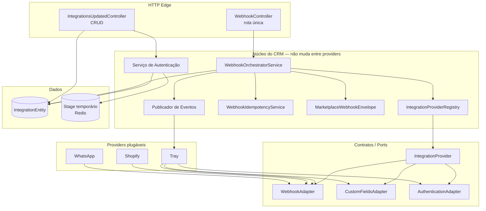
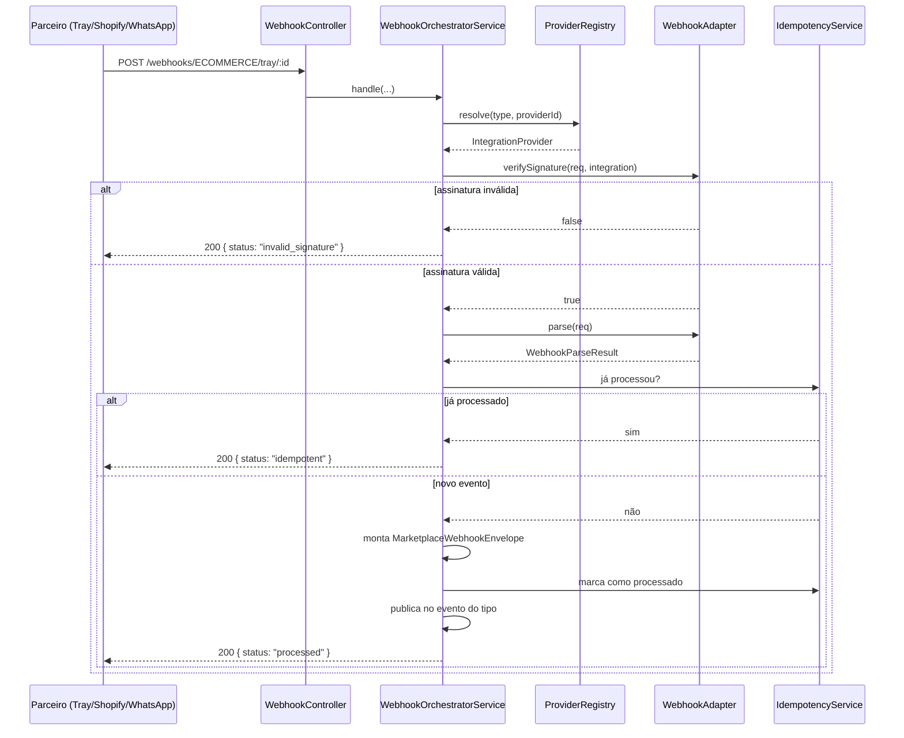
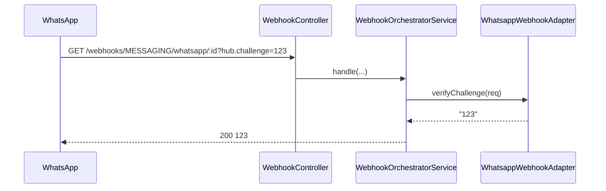

# Integrações Atualizadas — Proposta de Arquitetura

> **Status:** spike em andamento  
> **Local no CRM:** `src/modules/integrations-updated`  
> **Base conceitual:** adaptação da proposta `spike-marketplace-proposta.md` para os padrões de arquitetura do CRM.
---

## 1. Resumo Executivo (não-técnico)

Hoje cada integração nova no CRM exige mexer em vários pontos do sistema: controller de webhook, validação de campos, repositório, mapeamento de payload. Isso deixa o código difícil de manter e cada parceiro novo vira um projeto.

A proposta **Integrações Atualizadas** transforma o CRM numa **plataforma plug-and-play de integrações**:

- O núcleo define **tomadas-padrão** (contratos).
- Cada parceiro é um **módulo plugável** que encaixa nessas tomadas.
- Para adicionar um novo parceiro, você cria apenas um novo diretório de provider.
- O controller de webhook é **único** para todos os parceiros.
- Todo payload estrangeiro é traduzido para uma **lingua franca** (modelos canônicos) antes de seguir para o resto do CRM.

**Metáfora:** em vez de construir um cômodo novo na casa para cada aparelho, a casa já tem tomadas-padrão na parede e cada aparelho traz seu próprio plugue.

---

## 2. Problema (por que mudar?)

No módulo `integrations` atual:

- Lógica de webhook espalhada por controllers (`tray`, `wavoip`, `api4com`, `facebook`).
- Validação de campos feita de forma manual e inconsistente.
- Payloads de parceiros diferentes chegam ao resto do CRM em formatos diferentes.
- Adicionar um novo parceiro exige tocar controller, handlers, mapeamentos e repositórios.
- Campos específicos de um parceiro sujam o modelo padrão ou ficam escondidos em JSONs sem schema.

---

## 3. Solução Proposta

### 3.1 Visão de alto nível



Duas peças entraram no diagrama:

- **Publicador de Eventos** — cada *tipo* de integração publica no seu próprio evento. O núcleo só despacha: se o tipo não tiver publicador registrado, nada acontece.
- **Serviço de Autenticação** — fluxo em dois passos, com um stage temporário entre o "entrar na conta" e o "confirmar".

### 3.2 Regra de ouro

> Para adicionar um provider novo, você só cria um novo diretório em `infra/providers/<novo>/`.  
> Se precisar abrir o núcleo ou mexer em outro provider, o formato do plugue está errado.

---

## 4. Arquitetura Técnica

### 4.1 Estrutura de pastas (padrão CRM)

```
src/modules/integrations-updated/
├── application/
│   ├── commands/              # CQRS: create-update, delete, receive-webhook, connect/confirm auth
│   ├── queries/               # CQRS: find-all, find-by-id, find-definitions
│   ├── controllers/           # IntegrationsUpdatedController + WebhookController
│   ├── dtos/                  # DTOs de entrada/saída + schemas Zod
│   ├── maps/                  # Automapper profiles
│   └── services/              # Registry, Orchestrator, Auth, Publicador, Redator de campos
├── domain/
│   ├── entities/              # Integration, IntegrationDefinition
│   ├── enums/                 # IntegrationType
│   ├── helpers/               # executeWithFreshToken
│   ├── repositories/          # IntegrationRepository + ports (IntegrationProvider, adapters)
│   └── value-objects/         # CanonicalOrder, CanonicalMessage, Envelope, CustomFieldSchema, Stage
├── infra/
│   ├── publishers/            # Um publicador por tipo de integração
│   ├── repositories/          # IntegrationPrismaRepository
│   └── providers/             # Tray, Shopify, WhatsApp
└── integrations-updated.module.ts
```

> **Nota:** `infra/publishers/` e `domain/helpers/` não existiam na primeira versão. Ambos
> nasceram da decisão de manter o núcleo genérico — o publicador por tipo é o que permite
> adicionar uma categoria nova de integração sem mexer no núcleo.

### 4.2 Camadas

| Camada | Responsabilidade | Exemplo |
|---|---|---|
| **Domain** | Regras de negócio puras, entidades, contratos | `Integration`, `IntegrationProvider`, `CanonicalOrder` |
| **Application** | Orquestra casos de uso, CQRS, controllers | `CreateUpdateIntegrationCommandHandler`, `WebhookOrchestratorService` |
| **Infra** | Implementa detalhes técnicos (Prisma, HTTP, HMAC) | `IntegrationPrismaRepository`, `TrayWebhookAdapter` |

### 4.3 Ports e Adapters

O núcleo define **ports** (interfaces) em `domain/repositories/integration-provider.port.ts`:

- `IntegrationProvider` — representa um parceiro (type, providerId, capabilities)
- `WebhookAdapter` — valida assinatura, faz parse, extrai idempotency key, responde challenge
- `CustomFieldsAdapter` — declara e extrai campos personalizados do provider
- `AuthenticationAdapter` — estratégias de autenticação (OAuth2, API key, etc.)

Cada provider em `infra/providers/<nome>/` entrega as implementações concretas desses ports.

**Otimização aplicada no curso do spike:** o `OrderAdapter` foi **removido**. Ele exigia que
todo provider de e-commerce implementasse uma busca de pedido "genérica", o que não existe —
cada parceiro tem API, autenticação e formato de resposta próprios. O provider ficou com
**uma** responsabilidade opcional: transformar o payload bruto no modelo canônico, quando ele
sabe fazer. A busca de dados deixou de ser um contrato do núcleo.

O mesmo vale para autenticação: o port ganhou `extractExternalId`, para que o provider diga
qual é o identificador do recurso na resposta (o id da loja, na Tray) em vez de o núcleo
adivinhar a chave.

---

## 5. Modelos Canônicos

### 5.1 Por que canônico?

Cada parceiro fala um dialeto diferente. A Tray envia `orderId` + `sellerId` + `act`. A Shopify envia `id` + `line_items` + `financial_status`. O WhatsApp envia `messages[0].id` + `from` + `text.body`.

Se o CRM precisar entender cada dialeto, o código vira um espaguete de `if (provider === "tray")`. Os **modelos canônicos** são a tradução para uma lingua franca.

### 5.2 `CanonicalOrder`

```ts
interface CanonicalOrder {
    externalId: string;            // id do pedido no parceiro
    tenantId: string;
    providerName: string;
    providerId: string;
    status: "CREATED" | "PAID" | "CANCELLED";
    total: { currency: string; value: number };
    items: Array<{ sku: string; quantity: number }>;
    customer: { name?: string; email?: string };
    createdAt: Date;
    updatedAt: Date;
    customFields?: Record<string, unknown>;  // campos declarados pelo provider
    providerData?: unknown;                  // escape hatch
}
```

### 5.3 `MarketplaceWebhookEnvelope`

Toda mensagem, venha de quem vier, é reescrita num envelope padrão:

```ts
interface MarketplaceWebhookEnvelope {
    eventId: string;
    eventType: string;             // ex: "order.created", "message.received"
    version: number;
    integrationType: IntegrationType;
    providerName: string;
    providerId: string;
    tenantId: string;
    correlationId: string;
    idempotencyKey: string;        // hash determinístico
    occurredAt: Date;
    receivedAt: Date;
    metadata: Record<string, unknown>;
    payload: Record<string, unknown>;
}
```

---

## 6. Campos Personalizados (Custom Fields)

Cada provider pode declarar campos extras que não existem no `CanonicalOrder` base.

### 6.1 Exemplo: Tray

```ts
class TrayCustomFieldsAdapter extends CustomFieldsAdapter {
    readonly schema = {
        fields: [
            { key: "scopeName", label: "Escopo", type: "string" },
            { key: "sellerName", label: "Loja", type: "string" },
            { key: "commission", label: "Comissão", type: "number" }
        ]
    };
}
```

### 6.2 Separação

| Tipo de campo | Onde fica | Exemplo |
|---|---|---|
| Comum a todos os providers | `CanonicalOrder` direto | `externalId`, `status`, `total` |
| Só esse provider tem, mas queremos padronizar | `customFields` | `scopeName`, `commission` (Tray) |
| Totalmente específico, sem equivalência | `providerData` | JSON bruto ou campos raros |

### 6.3 Campos sensíveis

O provider pode marcar um campo como sensível (tokens, segredos). Isso deixa de ser apenas
descrição: a camada que devolve a integração ao front **redige** esses campos antes da
resposta. Regra deliberada — na dúvida, redige. Exagerar atrapalha o front; vazar é incidente.

---

## 7. Fluxo do Webhook

### 7.1 Rota única

```
GET/POST /api/crm/integrations-updated/webhooks/:type/:provider/:integrationId
GET/POST /api/crm/integrations-updated/webhooks/:type/:provider/:integrationId/:secret
```

A segunda forma existe para parceiros que não conseguem configurar um header de assinatura.

### 7.2 Sequência



### 7.3 Publicação por tipo

O envelope não vira evento de qualquer jeito. Cada **tipo** de integração publica no seu
próprio evento, e o publicador fica registrado por tipo:

- E-commerce tem publicador próprio.
- Mensageria (WhatsApp) **não tem** — o webhook é aceito e não gera evento.

Um tipo sem publicador registrado é ignorado em silêncio. É uma escolha consciente por ora
(não polui log nem propaga erro), mas tem consequência: hoje o WhatsApp responde
`processed` para um webhook que não publicou nada. **Precisa ser fechado.**

### 7.4 Challenge GET (WhatsApp)



---

## 8. CRUD de Integrações

### 8.1 Endpoints

| Método | Rota | Descrição |
|---|---|---|
| GET | `/integrations-updated/definitions` | Lista providers registrados |
| GET | `/integrations-updated` | Lista integrações do tenant |
| GET | `/integrations-updated/:id` | Busca uma integração |
| POST | `/integrations-updated` | Cria integração |
| PUT | `/integrations-updated/:id` | Atualiza integração |
| DELETE | `/integrations-updated/:id` | Remove integração (soft delete) |
| POST | `/integrations-updated/:type/:providerId/auth/connect` | Passo 1 da autenticação |
| POST | `/integrations-updated/:type/:providerId/auth/confirm` | Passo 2 — grava a integração |

### 8.2 Validação com Zod

A criação/alteração de integração é validada com Zod antes de tocar no domínio:

```ts
export const createUpdateIntegrationSchema = z.object({
    id: z.string().uuid().optional(),
    name: z.string().min(1).max(255),
    type: z.nativeEnum(IntegrationType),
    active: z.boolean().optional(),
    providerId: z.string().min(1).max(255),
    fields: z.record(z.unknown()).default({})
});
```

Além disso, o handler resolve o provider e valida os campos contra o schema de `customFields` daquele provider. Campos desconhecidos são rejeitados.

### 8.3 Autenticação em dois passos

O front tem um wizard (escolher status, nomear a loja), então guardar credenciais antes da
confirmação faria sentido errado: integração meio autenticada ficaria no banco se o usuário
fechasse a tela. Por isso o fluxo é dividido:

```
1. connect   → o parceiro autentica, devolve tokens + id do recurso
              → tudo isso fica num stage temporário (Redis, 15 min)

2. confirm   → valida quem está conectando, checa se a loja já está em outro tenant,
                e só então grava a integração e apaga o stage
```

Três garantias no passo 2:

- **Tenant:** a sessão tem que ser a mesma que abriu o connect.
- **Recurso certo:** o id devolvido pelo parceiro tem que bater com a integração sendo atualizada.
- **Loja única:** a mesma loja não pode ser integrada por dois tenants.

O stage tem expiração curta e é consumido no uso — se o front cair, o dado morre sozinho.

**Lacuna conhecida:** o `connect` da Tray faz duas chamadas ao parceiro (autenticação + status
de pedido) e os status são obrigatórios. Se a segunda chamada falhar, o connect inteiro falha.
Precisa ser decidido se vale conectar sem esses dados.

---

## 9. Providers de Exemplo

### 9.1 Tray (e-commerce)

- Validação por segredo na URL (`:secret`)
- Capabilities: `webhook`, `authentication`, `customFields` — **`orders` foi removido** (ver 4.3)
- Autenticação: OAuth + captura de status de pedido
- Usa o host e o id de loja que o próprio Tray devolve
- Eventos: `order.created`, `order.paid`, etc.

### 9.2 Shopify (e-commerce)

- Validação por HMAC-SHA256 do `rawBody`
- Capabilities: `webhook` — **sem `orders`**, sem auth, sem customFields
- HMAC ainda é placeholder
- Não publica evento por enquanto (o provider ainda não sabe montar o modelo canônico)

### 9.3 WhatsApp (mensageria)

- Challenge GET para verificação
- Validação de assinatura (placeholder)
- Capabilities: `webhook` — sem auth, sem customFields
- **Não publica:** é mensageria e não há publicador para esse tipo

---

## 10. O que está pronto vs. o que falta

### 10.1 Pronto

- Estrutura de pastas no padrão CRM (`application/`, `domain/`, `infra/`)
- Entidade `Integration` com métodos de domínio
- Repositório Prisma com `@EntityTracker`
- CQRS: commands, queries, controllers, DTOs, Automapper profile
- Registry de providers
- Webhook controller funcional com challenge, validação, parse, idempotência e envelope
- Rota única de webhook (com e sem segredo)
- Modelos canônicos (`CanonicalOrder`, `CanonicalMessage`, `MarketplaceWebhookEnvelope`)
- Custom fields declarativos por provider
- Validação de criação com Zod
- Publicação de eventos **por tipo**, sem mexer no núcleo
- Autenticação em dois passos, com stage em Redis e checagem de tenant
- Redação de campos sensíveis na resposta
- Providers de exemplo: Tray, Shopify, WhatsApp

### 10.2 Falta para produção

- **Testes.** O mais grave: o fluxo de autenticação não tem nenhum, e é a parte com mais
  regra de segurança do módulo. Falta cobrir webhook, auth e publicação.
- **Publicação pode perder evento.** Hoje o evento é marcado como processado **antes** de
  publicar. Se a publicação falhar, o evento se perde e o retry do parceiro não resolve —
  o segundo request cai em "já processado". O mecanismo para desfazer a marcação já existe,
  só não está ligado. Falta decidir entre isso, fila de retry ou DLQ.
- **Mensageria sem sinal.** Falta decidir: log de warning, publicador para mensageria, ou
  rejeitar o tipo.
- Validar o host que a Tray devolve na autenticação (hoje é aceito sem verificação).
- Decidir se a idempotência sobrevive a reinício (Redis com TTL já está em uso; falta definir
  o prazo).
- Implementar HMAC real da Shopify e só então o mapeamento de evento dela
- Criar tabela separada para `IntegrationDefinition` (hoje é entidade em memória)
- Rate limiting granular por provider
- DLQ e retry

---

## 11. Como adicionar um novo provider

1. Criar `infra/providers/<novo>/`.
2. Implementar:
   - `<novo>.webhook.adapter.ts`
   - `<novo>.custom-fields.adapter.ts` (opcional)
   - `<novo>.authentication.adapter.ts` (opcional)
   - `<novo>.api.client.ts` (opcional — só se precisar de rotas próprias)
   - `<novo>.integration-provider.ts`
3. Implementar o mapeamento para o modelo canônico, **se** o provider deve gerar evento.
4. Se tiver `authentication.adapter.ts`, declarar também qual campo é o identificador do
   recurso na resposta.
5. Adicionar a classe do provider no array `integrationProviderClasses` de `integrations-updated.module.ts`.
6. **Zero** alteração em controller, registry, handler, envelope ou outros providers.

Se a integração for de uma categoria **nova** (e não só um partner novo), aí sim há um passo
a mais: criar o publicador daquele tipo e registrá-lo. Ainda assim, o núcleo não muda.

---

## 12. Como ativar o módulo

Adicionar em `src/services/crm/src/crm.module.ts`:

```ts
import { IntegrationsUpdatedModule } from "./modules/integrations-updated/integrations-updated.module";

@Module({
    imports: [
        // ... outros módulos
        IntegrationsUpdatedModule
    ]
})
export class CrmModule {}
```

---

## 13. Checklist de Validação do Spike

- [x] Rota única de webhook atende Tray, Shopify e WhatsApp
- [x] Nenhum `if (providerName === "tray")` fora de `infra/providers/**`
- [x] Novo provider = 1 diretório + 1 linha no array de definitions
- [x] `rawBody` preservado para HMAC
- [x] Segredo por instância, não env global
- [x] `idempotencyKey` determinística
- [x] `providerData` guarda campos exclusivos sem poluir `CanonicalOrder`
- [x] Novo tipo de integração = 1 publicador, sem tocar no núcleo
- [x] Fluxo de auth não deixa integração pela metade no banco
- [x] Token nunca volta na resposta ao front
- [x] Loja não pode ser integrada por dois tenants
- [ ] Consumer existe e enriquece o pedido
- [ ] Autenticação tem teste cobrindo tenant, expiração e loja duplicada
- [ ] Curva medida: 4º provider exige menos alterações que o 2º

---

## 14. Riscos e Mitigações

| Risco | Mitigação |
|---|---|
| Abstração cedo demais | Providers iniciais são manuais; conector genérico só depois de 3–4 implementações |
| `rawBody: true` global | Necessário para HMAC; em produção pode ser limitado por rota |
| Campos exclusivos viram canônicos | Regra dos 2 providers: só sobe se 2+ tiverem equivalência semântica |
| Webhook público sem proteção | `@Public` + `@WebhookThrottler` + validação de assinatura por provider |
| Abstrair demais | O `OrderAdapter` foi removido justamente por isso: não existe "buscar pedido" genérico. Só o que é realmente comum vira port |
| Segredo no caminho da URL | Rotate por integração; migrar para header quando o partner suportar |
| Stage de auth vaza token | Redis com expiração curta, consumido no uso, e tokens redigidos na resposta |
| Evento marcado como processado antes de publicar | Bug conhecido e prioritized na lista de faltantes |

---

## 16. Avaliação crítica: o que melhorou vs. o que ainda está ruim

> Esta seção foi escrita para balancear o spike. Os itens abaixo são observações
> concretas do código em `src/modules/integrations-updated` comparado ao
> `src/modules/integrations` atual.

### 16.1 O que é realmente melhor na nova arquitetura

1. **Separação por ports/adapters**
   - Cada provider vive em `infra/providers/<nome>/` e implementa contratos do domínio.
   - O núcleo (`WebhookOrchestratorService`, `IntegrationAuthService`) não sabe quem é Tray, Shopify ou WhatsApp.

2. **Rota única de webhook**
   - O antigo espalha endpoints por provider (`/webhook/api4com`, `/webhook/wavoip/...`, `/tray/webhook/...`).
   - O novo usa `/:type/:provider/:integrationId` para todos.

3. **Validação declarativa de campos**
   - Schema `CustomFieldSchema` por provider gera Zod automaticamente.
   - No antigo cada provider implementa `validatedFields` de forma imperativa e inconsistente.

4. **Redação de campos sensíveis**
   - Campos marcados como `sensitive` são removidos automaticamente das respostas do CRUD.
   - No antigo tokens frequentemente voltam ao front.

5. **Auth em dois passos genérica**
   - Stage temporário em Redis com validação de tenant/externalId.
   - No antigo só Tray tem isso, hardcoded em `TrayAuthenticatorService`.

6. **Refresh de token genérico**
   - `executeWithFreshToken` no domínio pode ser reutilizado por qualquer provider.
   - No antigo o refresh é específico da Tray.

### 16.2 O que é conceitualmente ruim ou arriscado na nova arquitetura

> Os itens abaixo são **problemas de design**, não falta de implementação. Eles
> precisam ser discutidos porque persistem mesmo quando o spike estiver "pronto".

1. **Evento marcado como processado antes de publicar**
   - `WebhookOrchestratorService` chama `idempotencyService.tryMarkAsProcessed` e depois `eventPublisher.publish`.
   - Se a publicação falhar, o evento se perde e o retry do parceiro não resolve.
   - **Status:** decisão ruim de idempotência, precisa ser corrigida no design.

2. **Tipos sem publicador respondem 200 "processed"**
   - WhatsApp (`MESSAGING`) não tem publicador, mas o webhook retorna `status: "processed"`.
   - O parceiro recebe sucesso sem nada ter acontecido.
   - **Status:** semântica de resposta mal definida; o núcleo deveria saber se o tipo tem publicador antes de responder sucesso.

3. **Modelo canônico ainda não tem consumidor no design**
   - `CanonicalOrder` e `CanonicalMessage` existem como interfaces, mas o publicador de e-commerce ainda usa `CanonicalWebhookPayload`.
   - Risco de o canônico virar camada morta: bonita no papel, mas quem consome é outro payload.

4. **Idempotência só em Redis**
   - `WebhookIdempotencyService` usa Redis com TTL de 24h.
   - Reinício do Redis permite reprocessamento; não há opção de persistência durável.
   - **Status:** arquitetura depende de infra volátil para garantia de negócio.

5. **Duplicação conceitual com o antigo**
   - Ambos os módulos apontam para a mesma tabela `IntegrationEntity` e publicam o mesmo `EcommerceWebhookKafkaEvent`.
   - Se os dois ficarem ativos, o mesmo webhook pode gerar dois eventos para o mesmo listener.
   - **Status:** coexistência dos dois módulos não foi resolvida na arquitetura.

6. **Mapeamento de tipos antigos vs. novos não foi pensado**
   - O antigo usa tipos como `tray`, `wavoip`, `api4com`, `facebook`.
   - O novo usa `ECOMMERCE`, `MESSAGING`.
   - Ainda não está claro se Wavoip/API4COM viram `MESSAGING`, `VOIP` ou ficam fora da nova arquitetura.

7. **`toEnvelope` no provider parece não ter lugar no fluxo real**
   - `IntegrationProvider` define `toEnvelope`, mas o `WebhookOrchestratorService` monta o envelope no núcleo.
   - Isso deixa o contrato do provider confuso: parte do envelope é feita pelo provider, parte pelo núcleo.

8. **Responsabilidade do `MarketplaceEventHandler`**
   - Existe um `ReceiveWebhookCommand` + `MarketplaceEventHandler` além do `WebhookOrchestratorService`.
   - Os dois caminhos fazem coisas parecidas, mas um tem idempotência e o outro tem um `// TODO: idempotência`.
   - **Status:** duplicidade de fluxo que precisa ser unificada no design.

### 16.3 Recomendação conceitual

A nova arquitetura é **superior em abstração e extensibilidade**, mas tem
**decisões de design que precisam ser ajustadas antes de virar padrão**. A sugestão é:

1. Mantenha o conceito de **rota única + ports/adapters + modelos canônicos**.
2. Corrija a semântica de idempotência: só responda "processado" depois de publicar com sucesso.
3. Defina se o modelo canônico é de fato consumido ou se é apenas um intermediário; se for intermediário, simplifique.
4. Resolva a coexistência com o `integrations` antigo: não dá para dois módulos publicarem o mesmo evento para a mesma tabela.
5. Decida o mapa de tipos: o que vira `ECOMMERCE`, `MESSAGING`, `VOIP`, `LEADGEN`, etc.

---

