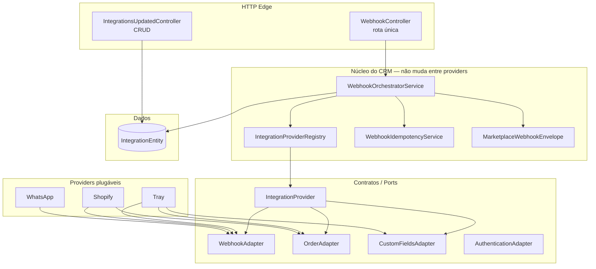
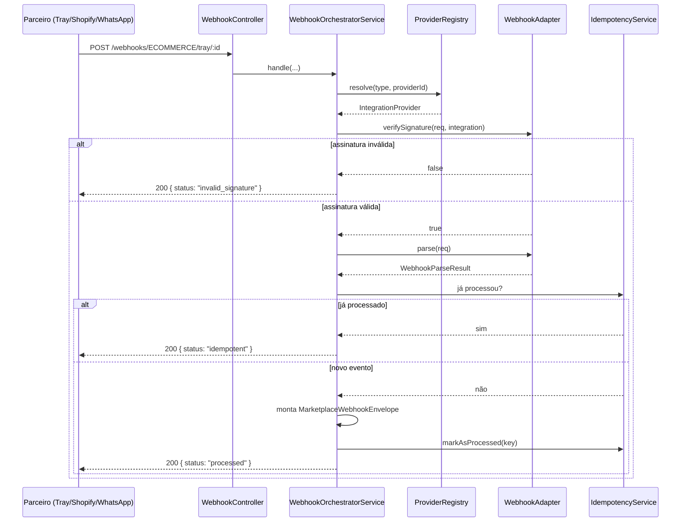
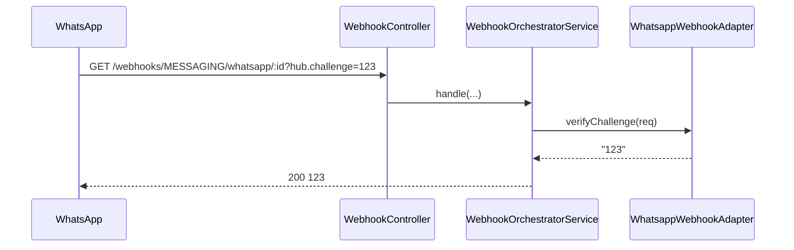

# Integrações Atualizadas — Proposta de Arquitetura

> **Status:** spike em andamento  
> **Local no CRM:** `src/modules/integrations-updated`  
> **Base conceitual:** adaptação da proposta `spike-marketplace-proposta.md` para os padrões de arquitetura do CRM.
---

## 1. Resumo Executivo (não-técnico)

Hoje cada integração nova no CRM exige mexer em vários pontos do sistema: controller de webhook, validação de campos, repositório, mapeamento de payload. Isso deixa o código difícil de manter e cada parceiro novo vira um projeto.

A proposta **Integrações Atualizadas** transforma o CRM numa **plataforma plug-and-play de integrações**:

- O núcleo define **tomadas-padrão** (contratos).
- Cada parceiro é um **módulo plugável** que encaixa nessas tomadas.
- Para adicionar um novo parceiro, você cria apenas um novo diretório de provider.
- O controller de webhook é **único** para todos os parceiros.
- Todo payload estrangeiro é traduzido para uma **lingua franca** (modelos canônicos) antes de seguir para o resto do CRM.

**Metáfora:** em vez de construir um cômodo novo na casa para cada aparelho, a casa já tem tomadas-padrão na parede e cada aparelho traz seu próprio plugue.

---

## 2. Problema (por que mudar?)

No módulo `integrations` atual:

- Lógica de webhook espalhada por controllers (`tray`, `wavoip`, `api4com`, `facebook`).
- Validação de campos feita de forma manual e inconsistente.
- Payloads de parceiros diferentes chegam ao resto do CRM em formatos diferentes.
- Adicionar um novo parceiro exige tocar controller, handlers, mapeamentos e repositórios.
- Campos específicos de um parceiro sujam o modelo padrão ou ficam escondidos em JSONs sem schema.

---

## 3. Solução Proposta

### 3.1 Visão de alto nível



### 3.2 Regra de ouro

> Para adicionar um provider novo, você só cria um novo diretório em `infra/providers/<novo>/`.  
> Se precisar abrir o núcleo ou mexer em outro provider, o formato do plugue está errado.

---

## 4. Arquitetura Técnica

### 4.1 Estrutura de pastas (padrão CRM)

```
src/modules/integrations-updated/
├── application/
│   ├── commands/              # CQRS: create-update, delete, receive-webhook
│   ├── queries/               # CQRS: find-all, find-by-id, find-definitions
│   ├── controllers/           # IntegrationsUpdatedController + WebhookController
│   ├── dtos/                  # DTOs de entrada/saída + schemas Zod
│   ├── maps/                  # Automapper profiles
│   └── services/              # IntegrationProviderRegistry, WebhookOrchestratorService, etc.
├── domain/
│   ├── entities/              # Integration, IntegrationDefinition
│   ├── enums/                 # IntegrationType
│   ├── repositories/          # IntegrationRepository + ports (IntegrationProvider, adapters)
│   └── value-objects/         # CanonicalOrder, CanonicalMessage, Envelope, CustomFieldSchema
├── infra/
│   ├── repositories/          # IntegrationPrismaRepository
│   └── providers/             # Tray, Shopify, WhatsApp
└── integrations-updated.module.ts
```

### 4.2 Camadas

| Camada | Responsabilidade | Exemplo |
|---|---|---|
| **Domain** | Regras de negócio puras, entidades, contratos | `Integration`, `IntegrationProvider`, `CanonicalOrder` |
| **Application** | Orquestra casos de uso, CQRS, controllers | `CreateUpdateIntegrationCommandHandler`, `WebhookOrchestratorService` |
| **Infra** | Implementa detalhes técnicos (Prisma, HTTP, HMAC) | `IntegrationPrismaRepository`, `TrayWebhookAdapter` |

### 4.3 Ports e Adapters

O núcleo define **ports** (interfaces) em `domain/repositories/integration-provider.port.ts`:

- `IntegrationProvider` — representa um parceiro (type, providerId, capabilities)
- `WebhookAdapter` — valida assinatura, faz parse, extrai idempotency key, responde challenge
- `OrderAdapter` — busca pedido no parceiro e converte para `CanonicalOrder`
- `CustomFieldsAdapter` — declara e extrai campos personalizados do provider
- `AuthenticationAdapter` — estratégias de autenticação (OAuth2, API key, etc.)

Cada provider em `infra/providers/<nome>/` entrega as implementações concretas desses ports.

---

## 5. Modelos Canônicos

### 5.1 Por que canônico?

Cada parceiro fala um dialeto diferente. A Tray envia `orderId` + `sellerId` + `act`. A Shopify envia `id` + `line_items` + `financial_status`. O WhatsApp envia `messages[0].id` + `from` + `text.body`.

Se o CRM precisar entender cada dialeto, o código vira um espaguete de `if (provider === "tray")`. Os **modelos canônicos** são a tradução para uma lingua franca.

### 5.2 `CanonicalOrder`

```ts
interface CanonicalOrder {
    externalId: string;            // id do pedido no parceiro
    tenantId: string;
    providerName: string;
    providerId: string;
    status: "CREATED" | "PAID" | "CANCELLED";
    total: { currency: string; value: number };
    items: Array<{ sku: string; quantity: number }>;
    customer: { name?: string; email?: string };
    createdAt: Date;
    updatedAt: Date;
    customFields?: Record<string, unknown>;  // campos declarados pelo provider
    providerData?: unknown;                  // escape hatch
}
```

### 5.3 `MarketplaceWebhookEnvelope`

Toda mensagem, venha de quem vier, é reescrita num envelope padrão:

```ts
interface MarketplaceWebhookEnvelope {
    eventId: string;
    eventType: string;             // ex: "order.created", "message.received"
    version: number;
    integrationType: IntegrationType;
    providerName: string;
    providerId: string;
    tenantId: string;
    correlationId: string;
    idempotencyKey: string;        // hash determinístico
    occurredAt: Date;
    receivedAt: Date;
    metadata: Record<string, unknown>;
    payload: Record<string, unknown>;
}
```

---

## 6. Campos Personalizados (Custom Fields)

Cada provider pode declarar campos extras que não existem no `CanonicalOrder` base.

### 6.1 Exemplo: Tray

```ts
class TrayCustomFieldsAdapter extends CustomFieldsAdapter {
    readonly schema = {
        fields: [
            { key: "scopeName", label: "Escopo", type: "string" },
            { key: "sellerName", label: "Loja", type: "string" },
            { key: "commission", label: "Comissão", type: "number" }
        ]
    };
}
```

### 6.2 Separação

| Tipo de campo | Onde fica | Exemplo |
|---|---|---|
| Comum a todos os providers | `CanonicalOrder` direto | `externalId`, `status`, `total` |
| Só esse provider tem, mas queremos padronizar | `customFields` | `scopeName`, `commission` (Tray) |
| Totalmente específico, sem equivalência | `providerData` | JSON bruto ou campos raros |

---

## 7. Fluxo do Webhook

### 7.1 Rota única

```
GET/POST /api/crm/integrations-updated/webhooks/:type/:provider/:integrationId
```

### 7.2 Sequência



### 7.3 Challenge GET (WhatsApp)



---

## 8. CRUD de Integrações

### 8.1 Endpoints

| Método | Rota | Descrição |
|---|---|---|
| GET | `/integrations-updated/definitions` | Lista providers registrados |
| GET | `/integrations-updated` | Lista integrações do tenant |
| GET | `/integrations-updated/:id` | Busca uma integração |
| POST | `/integrations-updated` | Cria integração |
| PUT | `/integrations-updated/:id` | Atualiza integração |
| DELETE | `/integrations-updated/:id` | Remove integração (soft delete) |

### 8.2 Validação com Zod

A criação/alteração de integração é validada com Zod antes de tocar no domínio:

```ts
export const createUpdateIntegrationSchema = z.object({
    id: z.string().uuid().optional(),
    name: z.string().min(1).max(255),
    type: z.nativeEnum(IntegrationType),
    active: z.boolean().optional(),
    providerId: z.string().min(1).max(255),
    fields: z.record(z.unknown()).default({})
});
```

Além disso, o handler resolve o provider e valida os campos contra o schema de `customFields` daquele provider. Campos desconhecidos são rejeitados.

---

## 9. Providers de Exemplo

### 9.1 Tray (e-commerce)

- Validação por segredo na URL (`?secret=...`)
- Capabilities: webhook, orders, customFields
- Eventos: `order.created`, `order.paid`, etc.

### 9.2 Shopify (e-commerce)

- Validação por HMAC-SHA256 do `rawBody`
- Capabilities: webhook, orders
- Placeholder para validação real

### 9.3 WhatsApp (mensageria)

- Challenge GET para verificação
- Validação de assinatura (placeholder)
- Eventos: `message.received`

---

## 10. O que está pronto vs. o que falta

### 10.1 Pronto

- Estrutura de pastas no padrão CRM (`application/`, `domain/`, `infra/`)
- Entidade `Integration` com métodos de domínio
- Repositório Prisma com `@EntityTracker`
- CQRS: commands, queries, controllers, DTOs, Automapper profile
- Registry de providers
- Webhook controller funcional com challenge, validação, parse, idempotência e envelope
- Rota única de webhook
- Modelos canônicos (`CanonicalOrder`, `CanonicalMessage`, `MarketplaceWebhookEnvelope`)
- Custom fields declarativos por provider
- Validação de criação com Zod
- Providers de exemplo: Tray, Shopify, WhatsApp

### 10.2 Falta para produção

- Implementar HMAC real da Shopify
- Implementar chamadas de API externas nos `OrderAdapter`s
- Persistir idempotência (hoje em memória)
- Publicar envelope no Kafka/event bus
- Adicionar testes unitários
- Criar tabela separada para `IntegrationDefinition` (hoje é entidade em memória)
- Rate limiting granular por provider
- DLQ e retry

---

## 11. Como adicionar um novo provider

1. Criar `infra/providers/<novo>/`.
2. Implementar:
   - `<novo>.webhook.adapter.ts`
   - `<novo>.order.adapter.ts` (opcional)
   - `<novo>.custom-fields.adapter.ts` (opcional)
   - `<novo>.integration-provider.ts`
3. Adicionar a classe do provider no array `integrationProviderClasses` de `integrations-updated.module.ts`.
4. **Zero** alteração em controller, registry, handler, envelope ou outros providers.

---

## 12. Como ativar o módulo

Adicionar em `src/services/crm/src/crm.module.ts`:

```ts
import { IntegrationsUpdatedModule } from "./modules/integrations-updated/integrations-updated.module";

@Module({
    imports: [
        // ... outros módulos
        IntegrationsUpdatedModule
    ]
})
export class CrmModule {}
```

---

## 13. Checklist de Validação do Spike

- [x] Rota única de webhook atende Tray, Shopify e WhatsApp
- [x] Nenhum `if (providerName === "tray")` fora de `infra/providers/**`
- [x] Novo provider = 1 diretório + 1 linha no array de definitions
- [x] `rawBody` preservado para HMAC
- [x] Segredo por instância (`integration.fields.webhookSecret`), não env global
- [x] `idempotencyKey` determinística
- [ ] Consumer usa `def.capabilities.orders`, nunca `providerName`
- [x] `providerData` guarda campos exclusivos sem poluir `CanonicalOrder`
- [ ] Curva medida: 4º provider exige menos alterações que o 2º

---

## 14. Riscos e Mitigações

| Risco | Mitigação |
|---|---|
| Abstração cedo demais | Providers iniciais são manuais; conector genérico só depois de 3–4 implementações |
| `rawBody: true` global | Necessário para HMAC; em produção pode ser limitado por rota |
| Idempotência em memória | Spike usa Map; produção deve usar Redis/Prisma |
| Campos exclusivos viram canônicos | Regra dos 2 providers: só sobe se 2+ tiverem equivalência semântica |
| Webhook público sem proteção | `@Public` + `@WebhookThrottler` + validação de assinatura por provider |

