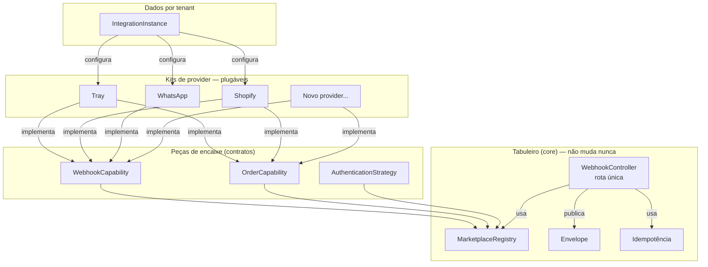
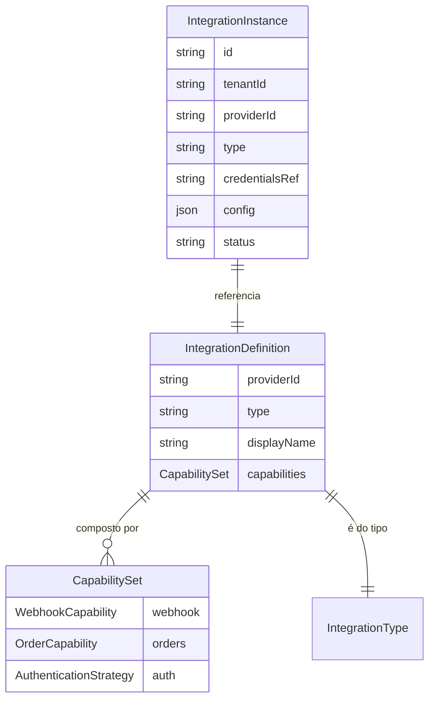
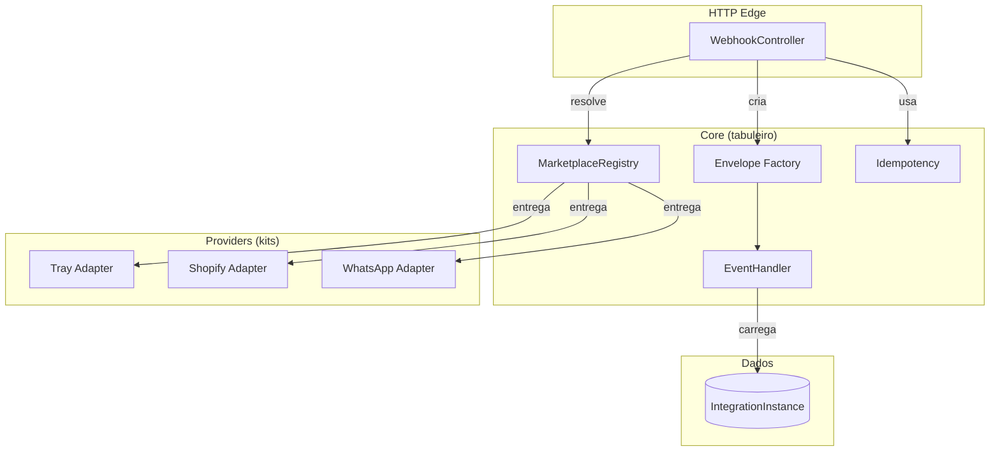
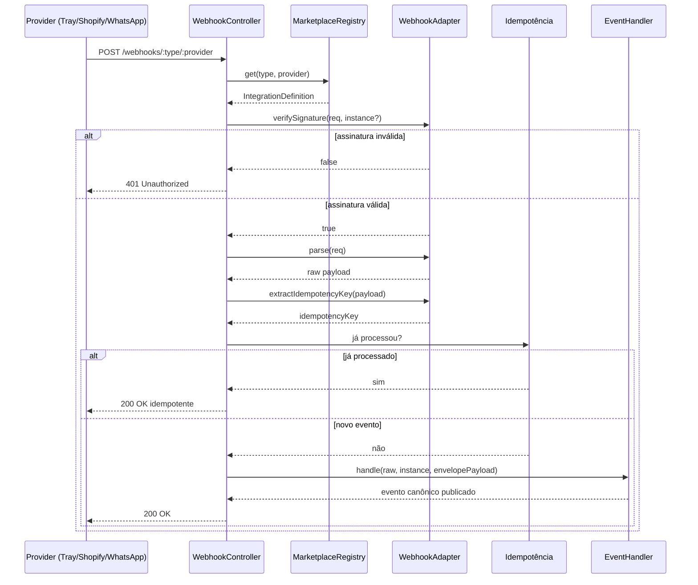
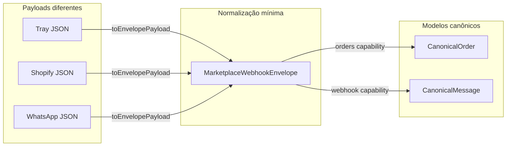
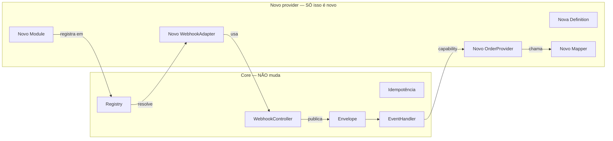

# Spike: Marketplace de Integrações — Proposta Plug-and-Play

> **Para quem é este documento:** você, raciocinando antes da apresentação; e a empresa, entendendo o investimento sem mergulhar em código.
>
> **Tom:** técnico e não-técnico misturados. Conceito simples primeiro, tradução técnica depois, entre parênteses.
>
> **Objetivo do spike:** validar que dá para conectar um novo parceiro (Tray, Shopify, WhatsApp, Hotmart…) sem mexer no coração do sistema, começando pequeno e encaixando peças aos poucos.

---

## 1. A ideia central: integração como Lego, não como obra

**Não-técnico:** Hoje cada integração nova é como construir um cômodo novo em uma casa: quebra parede, passa fiação, pinta. A proposta é transformar isso em **móveis modulares**: o sistema é a sala, e cada integração é um móvel que encaixa em tomadas-padrão na parede. A sala não muda; só o móvel muda.

**Técnico:** Em vez do código perguntar `if (provider === "tray") { ... }` espalhado pelo sistema, o núcleo pergunta por **capability** (`orders?`, `webhook?`) e um **registry** resolve qual implementação concreta atende aquele `(tipo, provider)`. Isso é inversão de controle: o núcleo define as portas, os providers entregam os adaptadores.

**A metáfora do plug-and-play:**

| Peça do Lego | O que é na prática | Analogia do dia a dia |
|---|---|---|
| **Tabuleiro (core)** | Registry, rota única de webhook, envelope, idempotência | A tomada na parede |
| **Peça de encaixe (capability)** | Contrato tipado: `OrderCapability`, `WebhookCapability` | O formato do plugue (2 pinos, 3 pinos) |
| **Módulo do provider** | Tray, Shopify, WhatsApp, Hotmart | O aparelho que você liga |
| **Configuração por tenant** | `IntegrationInstance` (loja 1001, segredo X, tenant-1) | O cadastro do aparelho na conta do cliente |

> **Regra de ouro:** para adicionar um provider novo, você só cria um novo módulo. Se precisar abrir o `core` ou mexer em outro provider, o formato do plugue está errado.

### 1.1 Visão geral das peças



---

## 2. O que já está maduro nos seus documentos (vale a pena manter)

Depois de ler os quatro markdowns e o MVP em `/marketplace`, estas são as decisões que mais valem à pena:

### 2.1 Definition × Instance

**Não-técnico:** Separa "o que o parceiro sabe fazer" do "quem realmente conectou".

**Técnico:**
- `IntegrationDefinition`: código, singleton, sem tenant. Diz que "Tray sabe webhook + orders".
- `IntegrationInstance`: dado, por tenant. Diz que "tenant-1 conectou a loja 1001 da Tray com segredo X".

**Por que mantém:** evita o erro clássico de misturar comportamento e estado numa única classe `TrayIntegration`.



### 2.2 Capability como objeto tipado, não enum

**Não-técnico:** Não basta dizer "a Tray faz pedidos". Você precisa da peça que realmente faz pedidos, com os conectores certos.

**Técnico:**

```ts
// ✅ objeto tipado — o tipo já entrega a implementação
interface CapabilitySet {
  webhook?: WebhookCapability;
  orders?: OrderCapability;
}

// ❌ enum flat — te obriga a cast inseguro depois
interface BadDefinition {
  capabilities: ("webhook" | "orders")[];
}
```

### 2.3 Rota única de webhook + adapter por provider

**Não-técnico:** Uma única porta de entrada para todos os parceiros. Cada um valida do seu jeito, mas o caminho de entrada é o mesmo.

**Técnico:** `GET/POST /webhooks/:type/:provider/:secret?` despacha para `WebhookAdapter`. A variação (HMAC, segredo na URL, challenge GET) vive no adapter, nunca no controller.

### 2.4 Envelope canônico

**Não-técnico:** Toda mensagem, venha de quem vier, é reescrita numa "carta padrão" com os mesmos campos: de quem veio, que evento é, qual o id do pedido, quando aconteceu.

**Técnico:** `MarketplaceWebhookEnvelope` com `eventType` canônico (`order.created`), `idempotencyKey` determinística, `tenantId`, `providerId`, `payload`, `metadata`.

### 2.5 Idempotência determinística

**Não-técnico:** Se a Tray reenviar o mesmo aviso, o sistema reconhece e não processa de novo. O retry do parceiro não vira pedido duplicado.

**Técnico:** `idempotencyKey = hash(providerId + externalEventId)`. Mesmo payload = mesma chave. Lock + marcação de "já processado".

### 2.6 `providerData` como escape hatch

**Não-técnico:** Se só um parceiro tem um campo especial, ele fica num cantinho separado, não suja o modelo padrão.

**Técnico:** `CanonicalOrder.providerData?: unknown`. Campos sem equivalência semântica em 2+ providers não viram campo canônico.

### 2.7 Auth por Strategy

**Não-técnico:** OAuth2, API key, basic auth viram "peças de autenticação" reutilizáveis. Yampi e Shopify podem usar a mesma peça, só com configuração diferente.

**Técnico:** `abstract class AuthenticationStrategy` com implementações `OAuth2Strategy`, `ApiKeyStrategy`, `ClientCredentialsStrategy`.

### 2.8 Não fazer conector universal no primeiro dia

**Não-técnico:** Não tente criar uma peça que sirva para todos os aparelhos antes de conhecer os aparelhos. As 3 primeiras integrações são manuais para descobrir o padrão.

**Técnico:** Só abstrair o conector config-driven depois de 3–4 providers manuais evidenciarem a repetição.

---

## 3. O que NÃO vale a pena no spike inicial (corte consciente)

A proposta é **começar pequeno, medir, depois adicionar peças**. Estes itens são valiosos, mas para depois:

| Item | Por que cortar agora | Quando voltar |
|---|---|---|
| **Kafka como transporte obrigatório** | O monorepo já tem Kafka, mas para validar a tese da rota única, o handler pode ser síncrono no mesmo processo. | Assim que o spike provar que providers encaixam, migrar para `@KafkaTopic` + `QueueProcessor`. |
| **CredentialVault como porta separada** | CryptoHelpers já existe. No spike, criptografar no repo é suficiente. | Quando houver múltiplos serviços consumindo credenciais. |
| **Conector genérico config-driven** | Sem 3 providers manuais, você não sabe quais variações precisa suportar. | Após a 3ª/4ª integração, se o padrão se repetir. |
| **DLQ complexa** | Retry local + log de erro basta para provar o conceito. | Quando o handler for realmente assíncrono em produção. |
| **Schema registry / Avro** | `metadata.schemaVersion` em JSON é suficiente para começar. | Quando o volume de eventos justificar. |
| **Canonical models para tudo** | Comece só com `Order` (e-commerce) e `Message` (mensageria). Não force `CanonicalProduct` se ninguém ainda cruza produtos. | Quando um segundo consumer precisar cruzar aquele recurso. |
| **Múltiplos microserviços** | O "marketplace" pode nascer como **um novo serviço** (o que você já propôs), mas não precisa de 3 serviços no spike. | Quando o tráfego/domínio exigir separar order-sync, notification, etc. |
| **`onModuleInit` self-registration** | O monorepo usa token nomeado + array explícito. Manter isso é mais previsível e pega erro de módulo esquecido em teste. | Se o array ficar gigante, aí sim avaliar auto-registro. |

> **Princípio do corte:** se uma peça não é necessária para provar "novo provider sem mexer no core", ela fica para a fase 2.

---

## 4. O spike: o que vamos construir

### 4.1 Escopo mínimo viável

**Objetivo:** ter um serviço `marketplace` novo, com **3 providers** passando pela mesma rota de webhook, cada um com validação diferente, e produzindo eventos canônicos.

**Providers do spike:**
1. **Tray** (e-commerce) — validação por segredo na URL.
2. **Shopify** (e-commerce) — validação por HMAC-SHA256 do `rawBody`.
3. **WhatsApp** (mensageria) — validação por challenge GET + correlação por `phone_number_id`.

**Por que esses 3:** cobrem os 3 perfis de validação mais comuns (segredo, assinatura, challenge). Se a rota única aguenta esses 3, aguenta dezenas.

### 4.2 O tabuleiro (core) — peças fixas

```
marketplace/
  src/
    core/
      registry/
        marketplace.registry.ts          # índice type:providerName
        integration-key.ts               # value object da chave composta
        integration-not-found.exception.ts
      capabilities/
        capability-set.ts                # { webhook?, orders?, auth? }
        webhook-adapter.ts               # contrato de validação/parsing
        webhook-capability.ts
        order-capability.ts              # getOrder(externalId)
      domain/
        integration-type.enum.ts         # ECOMMERCE, MESSAGING...
        integration-definition.ts        # o que o provider SABE fazer
        integration-instance.ts          # quem ESTÁ conectado
        canonical-order.ts               # contrato entre providers
      marketplace-core.module.ts         # @Global: registry + stores
    webhooks/
      webhook.controller.ts              # ROTA ÚNICA
    application/
      integration-instance.store.ts      # demo: array; prod: PrismaRepository
      marketplace-event.handler.ts       # envelope + idempotência + consume
      helpers/safe-compare.ts
    marketplace.module.ts                # agrega tudo + INTEGRATION_DEFINITIONS
```

**Não-técnico:** O tabuleiro é a parte que você constrói **uma vez**. Depois disso, ela não muda mais.



### 4.3 Os módulos de provider — peças plugáveis

```
providers/
  tray/
    tray.module.ts
    tray.definition.ts                 # registra capabilities no token
    tray.webhook.adapter.ts            # validação + parse + identifica evento
    tray.order.provider.ts             # implementa OrderCapability
    tray.order.mapper.ts               # TrayOrderRaw → CanonicalOrder
  shopify/
    shopify.module.ts
    shopify.definition.ts
    shopify.webhook.adapter.ts
    shopify.order.provider.ts
    shopify.order.mapper.ts
  whatsapp/
    whatsapp.module.ts
    whatsapp.definition.ts
    whatsapp.webhook.adapter.ts        # sem orders, só webhook
```

**Não-técnico:** Cada provider é um "kit de montar". Quando chega um quarto provider, você só adiciona mais um kit.

### 4.4 A rota única em detalhe

```
GET/POST /webhooks/:type/:provider/:secret?
```

**Não-técnico:** Uma única URL recebe todos os avisos. O sistema olha o caminho (`ecommerce/tray`, `ecommerce/shopify`, `messaging/whatsapp`) e entrega para o kit certo.

**Técnico — fluxo do controller:**

```
1. registry.get(type, provider) → IntegrationDefinition
2. pega adapter da capability webhook
3. (se GET) verifyChallenge → responde challenge
4. (se POST)
   4.1 resolveInstance? (URL/header) ou valida primeiro
   4.2 verifySignature(req, instance?) → 401 se falhar
   4.3 parse(req) → raw payload
   4.4 matchInstances?(payload) → identidade por body
   4.5 extractIdempotencyKey(payload)
   4.6 se já processado → 200 idempotente
   4.7 handler.handle(raw, instance, envelopePayload) → evento canônico
   4.8 responde 200
```

**Regras importantes:**
- Não chamar API externa no path HTTP (meta p99 < 100ms).
- Não fazer mapeamento completo para `CanonicalOrder` no HTTP path — isso é no handler/consumer.
- Preservar `rawBody` para HMAC (`bodyParser.verify`).



### 4.5 O envelope (a "carta padrão")

```json
{
  "eventId": "uuid",
  "eventType": "order.created",
  "version": 1,
  "integrationType": "ECOMMERCE",
  "providerName": "tray",
  "providerId": "1001",
  "tenantId": "tenant-1",
  "correlationId": "uuid",
  "idempotencyKey": "tray:1001:ORD-100:created",
  "occurredAt": "2026-09-28T10:00:00Z",
  "receivedAt": "2026-09-28T10:00:01Z",
  "metadata": { "schemaVersion": 1 },
  "payload": { "sellerId": "1001", "orderId": "ORD-100", "scopeName": "order", "act": "created" }
}
```

**Não-técnico:** Mesmo que Tray mande JSON, Shopify mande outro JSON e WhatsApp mande uma estrutura diferente, para o resto do sistema tudo chega na mesma carta padrão.



### 4.6 O CanonicalOrder mínimo

```ts
interface CanonicalOrder {
  externalId: string;           // id do pedido no provider
  tenantId: string;
  providerName: string;
  providerId: string;
  status: "CREATED" | "PAID" | "CANCELLED";
  total: { currency: string; value: number };
  items: Array<{ sku: string; quantity: number }>;
  customer: { name?: string; email?: string };
  createdAt: Date;
  updatedAt: Date;
  providerData?: unknown;       // escape hatch
}
```

**Não-técnico:** O contrato carrega só o que realmente é comum entre e-commerces. O resto fica no `providerData`, sem sujar o padrão.

---

## 5. A adoção em ondas (o plano de spike)

### Onda 1 — Tabuleiro de pé + Tray (2 semanas)

**Entrega:**
- Core (registry, envelope, rota única, idempotência).
- Tray de ponta a ponta: webhook → validação → evento canônico → `CanonicalOrder`.

**Prova:** novo pedido da Tray vira `order.created` e `CanonicalOrder` sem código específico no controller.

### Onda 2 — Shopify prova que a validação muda sem quebrar o core (1 semana)

**Entrega:**
- Shopify plugado na mesma rota.
- Validação por HMAC-SHA256 do `rawBody`.

**Prova:** o controller não sabe que é Shopify; só o adapter sabe.

### Onda 3 — WhatsApp prova outro domínio (1 semana)

**Entrega:**
- WhatsApp na rota única, com challenge GET.
- Evento `message.received` no mesmo envelope.

**Prova:** um novo `IntegrationType` (MESSAGING) entra sem alterar o core.

### Onda 4 — Medir a curva (1 semana)

**Entrega:**
- Adicionar um 4º provider (ex.: Yampi ou Hotmart) medindo arquivos tocados.
- Documentar o playbook.

**Prova:** o 4º provider exige menos alterações que o 2º.

### Onda 5 — Decidir o próximo salto

**Opções:**
- Mover handler para Kafka/`QueueProcessor`.
- Criar conector genérico config-driven.
- Adicionar capabilities novas (`products`, `customers`).

**Regra:** só decide com dados das ondas 1–4.

---

## 6. O playbook do novo provider

Quando chegar um parceiro novo, o trabalho é:

1. Criar `src/providers/<novo>/`.
2. Implementar:
   - `<novo>.definition.ts` — qual tipo e capabilities.
   - `<novo>.webhook.adapter.ts` — validação, parse, identifica evento, idempotency key.
   - `<novo>.order.provider.ts` + `<novo>.order.mapper.ts` — se expõe orders.
   - `<novo>.module.ts` — declara providers e exporta definition.
3. Adicionar a definition no array `INTEGRATION_DEFINITIONS` de `marketplace.module.ts`.
4. **Zero** alteração em: controller, registry, handler, envelope, core, outros providers.

**Não-técnico:** É como comprar um novo aparelho e ligar na tomada. A tomada não muda; só o aparelho é novo.



---

## 7. Checklist de sucesso do spike

- [ ] Rota única `/webhooks/:type/:provider` atende Tray, Shopify e WhatsApp.
- [ ] Nenhum `if (providerName === "tray")` fora de `src/providers/**`.
- [ ] Novo provider = 1 diretório + 1 linha no array de definitions.
- [ ] `rawBody` preservado; HMAC da Shopify valida byte a byte.
- [ ] Segredo por instância (`instance.credentials.webhookSecret`), não env global.
- [ ] `idempotencyKey` determinística: retry gera `[idempotent] skip`.
- [ ] Consumer usa `def.capabilities.orders`, nunca `providerName`.
- [ ] `providerData` guarda campos exclusivos sem poluir `CanonicalOrder`.
- [ ] Curva medida: 4º provider exige menos alterações que o 2º.

---

## 8. Riscos e como mitigar

| Risco | Mitigação |
|---|---|
| **Abstração cedo demais** | As 3 primeiras integrações são manuais. Conector genérico só depois. |
| **Capability vira plano de assinatura** | Config de plano vive em `IntegrationInstance.config`, nunca no `CapabilitySet`. |
| **Campos exclusivos viram canônicos** | Regra dos 2 providers: só sobe se 2+ tiverem equivalência semântica real. |
| **Secret global vaza entre tenants** | Secret por instância + `timingSafeEqual`. |
| **Webhook público sem proteção** | `@Public` + `@WebhookThrottler` + limite de body. |
| **Core cresce com exceções** | Se um provider precisar de comportamento novo, crie uma capability nova, não modifique uma existente. |

---

## 9. O que apresentar para a empresa

### Slide 1 — O problema

> Cada integração nova hoje é um projeto. A 10ª custa igual à 1ª.

### Slide 2 — A virada

> Em vez de perguntar "isso é da Tray?", o sistema pergunta "quem sabe entregar pedidos?". Novo parceiro entra pela mesma porta.

### Slide 3 — A prova de conceito

> 3 providers (Tray, Shopify, WhatsApp), 3 validações diferentes, 1 rota só. Nenhum código do core muda entre eles.

### Slide 4 — A curva de esforço

| Integração | Esforço |
|---|---|
| 1ª (Tray) | Alto — constrói o tabuleiro |
| 2ª (Shopify) | Médio — primeira peça nova |
| 3ª (WhatsApp) | Baixo — peça segue o molde |
| 4ª em diante | Mecânico — só o que é genuíno do provider |

### Slide 5 — O investimento

> Spike de 4–5 semanas para validar a tese. Se falhar, o custo é baixo e a lição é clara. Se funcionar, a 20ª integração será mais barata que a 2ª.

---

## 10. Resumo para você raciocinar

1. **Comece pelo tabuleiro:** core + Tray. Não tente generalizar antes.
2. **Adicione peças que provam variação:** Shopify (HMAC) e WhatsApp (challenge).
3. **Meça a curva:** o 4º provider deve ser mecânico.
4. **Só depois pense em conector genérico, Kafka obrigatório ou microserviços extras.**
5. **Regra de ouro:** se adicionar um provider exigir mexer no core, o plugue está errado — ajuste o formato do plugue, não dê um jeito.

---

**Documentos de referência:**
- `/marketplace-integrations-apresentacao.md` — versão não-técnica.
- `/marketplace-integrations-arquitetura.md` — arquitetura DataCrazy.
- `/marketplace-integrations-tecnico.md` — contratos e código de referência.
- `/marketplace/` — MVP executável.
- `/integration-platform-arquitetura (1).md` — crítica e refinamento da proposta.
