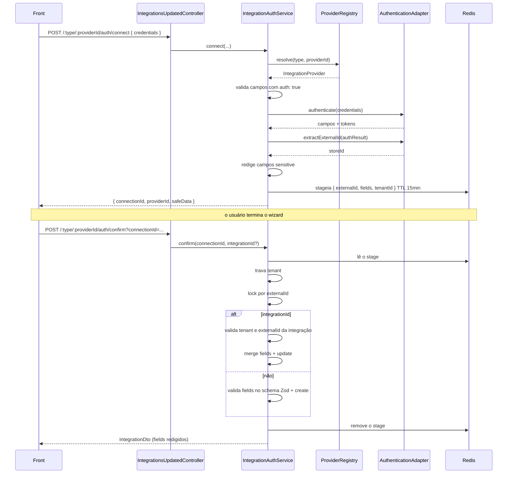
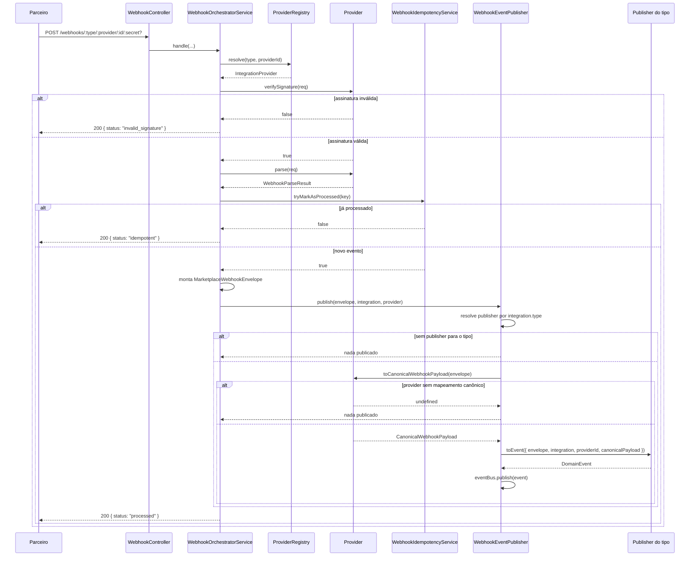

# Spike: Marketplace Integrations Architecture

> **Status:** spike concluído — decisões arquiteturais validadas  
> **Branch:** `feat/spike-integrations-arch`  
> **Implementação de referência:** `src/services/crm/src/modules/integrations-updated`  
> **Escopo implementado:** webhook (verificação, parse, idempotência, publicação por tipo),
> custom fields com validação Zod, fluxo de autenticação em 2 passos e redação de tokens.  
> **Sem commit:** as mudanças deste doc e do código de referência ainda não foram commitadas.

---

## 1. Objetivo

Definir uma arquitetura plug-and-play para integrações de marketplace (Tray, Shopify, Yampi, etc.) no CRM, onde:

- O núcleo é genérico e não muda entre providers.
- Cada provider é um plugue isolado em seu próprio diretório.
- Webhooks de todos os providers entram por uma rota única.
- Payloads estrangeiros são traduzidos para modelos canônicos antes de seguir para o resto do sistema.
- Providers que precisam de autenticação/tokens (Tray) têm seu próprio fluxo; providers webhook-only (Yampi) não precisam.

---

## 2. Princípios

1. **Núcleo fechado, providers abertos.** Se adicionar um provider exigir mudar controller, registry ou outro provider, o plugue está errado.
2. **Canônico onde faz sentido, específico onde não dá.** Não forçar equivalências semânticas entre providers distintos.
3. **Autenticação é uma capability, não uma obrigatoriedade.** Yampi não precisa de token; Tray precisa.
4. **Rotas específicas de API vivem em clients concretos por provider.** Não tentar abstrair `GET /orders`, `GET /products`, `GET /customers` numa interface única.

---

## 3. Arquitetura

### 3.1 Capabilities

Cada provider declara o que sabe fazer:

```ts
export interface ProviderCapabilitySet {
    webhook?: WebhookAdapter;
    auth?: AuthenticationAdapter;        // opcional — só quem usa token
    customFields?: CustomFieldsAdapter;
}
```

> **Removido nesta revisão:** `orders?: OrderAdapter`. A busca de pedido ficou fora do
> registry de capabilities — é responsabilidade de outro módulo e acontece por `TrayApiClient`
> (ver 3.4). Um `OrderAdapter` genérico só criava uma interface com um método que cada
> provider implementaria de um jeito diferente.

### 3.2 Ports (contratos do núcleo)

```ts
export abstract class WebhookAdapter {
    abstract verifySignature(input: WebhookVerificationInput): boolean | Promise<boolean>;
    abstract parse(input: WebhookVerificationInput): WebhookParseResult | Promise<WebhookParseResult>;
    verifyChallenge?(input: WebhookVerificationInput): string | undefined | Promise<string | undefined>;
}

export abstract class AuthenticationAdapter {
    abstract authenticate(credentials: Record<string, string>): Promise<Record<string, unknown>>;
    abstract extractExternalId(authResult: Record<string, unknown>): string | undefined;
    abstract refresh(integration: Integration): Promise<Record<string, unknown>>;
}

export abstract class IntegrationProvider {
    abstract readonly providerId: string;
    abstract readonly type: IntegrationType;
    abstract readonly displayName: string;
    abstract readonly capabilities: ProviderCapabilitySet;

    abstract toEnvelope(payload, integration): MarketplaceWebhookEnvelope | Promise<MarketplaceWebhookEnvelope>;

    toCanonicalWebhookPayload?(envelope): Record<string, unknown> | Promise<Record<string, unknown>>;
}

export abstract class CustomFieldsAdapter {
    abstract readonly schema: CustomFieldSchema;
    abstract extract(source: Record<string, unknown>): Record<string, unknown>;
}
```

O provider **não** publica evento. Ele só traduz o envelope para o payload canônico
(quando faz sentido); quem decide o formato do evento é o `WebhookEventPublisher` (ver 3.6).

### 3.3 Helper genérico de token refresh

Token refresh é cross-cutting, mas a lógica de refresh é provider-specific. Solução:

```ts
// domain/helpers/execute-with-fresh-token.ts
export async function executeWithFreshToken<T>(
    integration: Integration,
    authAdapter: AuthenticationAdapter,
    execute: (fields: Record<string, unknown>) => Promise<T>,
    maxRetries: number = 1
): Promise<T> {
    // tenta executar; em 401 chama authAdapter.refresh() e tenta de novo
}
```

Cada `AuthenticationAdapter` implementa seu próprio `refresh`. O helper só orquestra retry + refresh.

### 3.4 Clients específicos por provider

Não forçar todas as operações de API numa interface genérica. Cada provider expõe seu próprio client:

```ts
@Injectable()
export class TrayApiClient {
    constructor(private readonly authAdapter: TrayAuthenticationAdapter) {}

    async getOrder(orderId: string, integration: Integration): Promise<TrayOrder | undefined> { ... }
    async listOrderStatuses(integration: Integration): Promise<TrayOrderStatus[]> { ... }
    async listOrderStatusesWithFields(fields: TrayIntegrationFields): Promise<TrayOrderStatus[]> { ... }
}
```

O `TrayApiClient` usa `executeWithFreshToken` internamente. Outros módulos importam `TrayApiClient` e chamam métodos específicos.

O `listOrderStatusesWithFields` existe porque `listOrderStatuses(integration)` **não roda no
passo `connect`**: o helper depende de `integration.fields`, e no connect ainda não existe
integração — só `code`, `storeDomain` e o `accessToken` novo. A versão por fields não usa o
helper, porque nesse ponto não há o que renovar.

### 3.5 Modelos canônicos

#### Envelope de webhook

```ts
interface MarketplaceWebhookEnvelope {
    eventId: string;
    eventType: string;        // "order.inserted", "message.received"
    version: number;
    integrationType: IntegrationType;
    providerName: string;
    providerId: string;
    tenantId: string;
    correlationId: string;
    idempotencyKey: string;
    occurredAt: Date;
    receivedAt: Date;
    metadata: Record<string, unknown>;
    payload: Record<string, unknown>;
}
```

#### Payload canônico de webhook

```ts
interface CanonicalWebhookPayload {
    externalEventId?: string;
    externalOrderId?: string;
    externalSellerId?: string;
    externalCustomerId?: string;
    externalScopeId?: string;
    scope?: string;
    action?: string;
    providerData?: unknown;   // escape hatch com dados brutos
}
```

Cada provider mapeia seu payload bruto para `CanonicalWebhookPayload` antes de publicar no Kafka.

#### Pedido canônico

```ts
interface CanonicalOrder {
    externalId: string;
    tenantId: string;
    providerName: string;
    providerId: string;
    status: "CREATED" | "PAID" | "CANCELLED";
    total: { currency: string; value: number };
    items: Array<{ sku: string; quantity: number }>;
    customer: { name?: string; email?: string };
    createdAt: Date;
    updatedAt: Date;
    customFields?: Record<string, unknown>;
    providerData?: unknown;
}
```

`CanonicalOrder` continua existindo como modelo, mas **não** é mais buscado por capability —
quem enriquece pedido usa o client concreto do provider.

### 3.6 Publicação de eventos por tipo

Publicação não mora no provider. O `WebhookEventPublisher` é genérico e despacha pelo
`IntegrationType`:

```ts
// domain/repositories/integration-webhook-event-publisher.port.ts
export interface WebhookEventContext {
    envelope: MarketplaceWebhookEnvelope;
    integration: Integration;
    providerId: string;
    canonicalPayload: Record<string, unknown>;
}

export abstract class IntegrationWebhookEventPublisher {
    abstract readonly type: IntegrationType;
    abstract toEvent(context: WebhookEventContext): DomainEvent | undefined | Promise<DomainEvent | undefined>;
}
```

Cada tipo registra a sua própria implementação, que é dona do **formato do evento** e da
extração dos campos que só ele entende:

```ts
// infra/publishers/ecommerce/ecommerce-webhook-event.publisher.ts
@Injectable()
export class EcommerceWebhookEventPublisher extends IntegrationWebhookEventPublisher {
    readonly type = IntegrationType.ECOMMERCE;

    toEvent({ envelope, integration, providerId, canonicalPayload }: WebhookEventContext) {
        const fields = integration.fields as { storeDomain?: string; scopes?: unknown } | undefined;

        return createEcommerceWebhookKafkaEvent({
            tenantId: integration.tenantId,
            integrationId: integration.id,
            provider: providerId,
            storeId: integration.providerId,
            storeDomain: fields?.storeDomain ?? "",
            resourceId: this.resolveResourceId(canonicalPayload),
            event: envelope.eventType,
            payload: canonicalPayload,
            receivedAt: envelope.receivedAt.getTime(),
            scopes: fields?.scopes ?? []
        });
    }
}
```

O dispatcher registra as implementações no mesmo padrão de `INTEGRATION_PROVIDERS`:

```ts
export const integrationWebhookEventPublisherClasses = [EcommerceWebhookEventPublisher];

{
    provide: "INTEGRATION_WEBHOOK_EVENT_PUBLISHERS",
    useFactory: (...publishers) => publishers,
    inject: integrationWebhookEventPublisherClasses as any
}
```

**Dois gates de saída, ambos silenciosos (decisão conscious):**

1. `integration.type` sem publisher registrado → nada é publicado.
2. provider sem `toCanonicalWebhookPayload` → nada é publicado.

O segundo gate é proposital: sem mapeamento canônico não existe payload canônico, e
publicar o payload cru mascarado de canônico seria pior do que não publicar.

> **Hoje:** só `ECOMMERCE` tem publisher. `MESSAGING` é aceito pelo webhook e descartado sem
> log — o orchestrator ainda responde `status: "processed"`. Isso é uma lacuna conhecida
> (ver seção 10).

### 3.7 Fluxo de autenticação (connect + confirm)

O `AuthenticationAdapter` sabe *como* autenticar num provider, mas nada orquestrava *quando*.
O `IntegrationAuthService` é a peça que faltava e é genérico, em dois passos:



O passo `connect` não persiste nada de propósito: o usuário pode abandonar o wizard sem
deixar integração pela metade no banco.

**Por que `extractExternalId` é método do adapter e não um campo do resultado.** O
`providerId` da integração tem que ser o id do recurso no provider (o `store_id` da Tray).
Sem isso o núcleo teria que adivinhar uma chave no `Record<string, unknown>` devolvido.
Deixar o provider extrair também permite que ele valide o que veio na resposta — a Tray
devolve `api_host`, e o legado validava esse host antes de persistir.

**Três invariantes no `confirm`, todas pré-condição de escrita:**

1. **Tenant** — o stage carrega o `tenantId` de quem autenticou. Se não bater com a sessão
   atual, recusa. `SessionContext.get().tenantId` devolve `""` fora de sessão, então sessão
   vazia também recusa (senão `"" !== ""` passaria).
2. **`externalId` da integração** — só atualiza se o recurso autenticado for o mesmo da
   integração. Sem isso, um tenant confirmaria a loja de outro reaproveitando um `connectionId`.
3. **Store já integrada** — se já existe integração com aquele `externalId` e de outro tenant,
   recusa; se for do mesmo tenant, reaproveita em vez de duplicar.

**Redação de tokens.** Tudo que o schema marca como `sensitive` sai do `safeData` devolvido
no `connect` e de toda resposta `Integration -> IntegrationDto` (ver seção 4).

**Ciclo de DI evitado.** A Tray precisa dos status de pedido no `connect`, porque `scopes` é
campo `required` do schema dela. O `TrayApiClient` injeta o `TrayAuthenticationAdapter`, então
o adapter não pode injetar o client de volta. A chamada bruta ficou numa função
(`tray.api.requests.ts`) usada pelos dois lados, em vez de `forwardRef` ou GET duplicado.

---

## 4. Custom Fields

Cada provider declara seus campos. Adicionamos metadados para o front:

```ts
export interface CustomFieldDefinition {
    key: string;
    label: string;
    type: "string" | "number" | "boolean" | "date" | "json";
    required?: boolean;
    description?: string;
    sensitive?: boolean;       // mascara no front
    serverManaged?: boolean;   // não editável
    auth?: boolean;            // parte do fluxo de autenticação
}
```

Exemplo Tray:

```ts
{ key: "storeDomain", label: "Domínio da loja", type: "string", required: true },
{ key: "code", label: "Código de autorização", type: "string", required: true, sensitive: true, auth: true },
{ key: "accessToken", label: "Access Token", type: "string", required: true, sensitive: true, serverManaged: true, auth: true },
{ key: "refreshToken", label: "Refresh Token", type: "string", required: true, sensitive: true, serverManaged: true, auth: true },
```

Validação com Zod é gerada a partir do schema:

```ts
export function buildCustomFieldsSchema(schema: CustomFieldSchema): z.ZodType<Record<string, unknown>> {
    // mapeia tipos para zod, coerção, required, strict
}
```

### `sensitive` agora tem efeito

O flag existia só como metadado para o front e não era usado para nada no backend — `GET
/integrations-updated` devolvia `accessToken` e `refreshToken` em texto puro, assim como as
respostas de `POST` e `PUT`. Agora a redação acontece no profile do Automapper, que é o
único ponto por onde passa todo `Integration -> IntegrationDto`:

```ts
createMap(
    mapper,
    Integration,
    IntegrationDto,
    forMember((destination) => destination.fields, mapFrom((source) => this.fieldsRedactor.redact(source)))
);
```

O redactor usa a **união das chaves `sensitive` de todos os providers registrados**, não o
schema do provider da integração. É proposital: falha para o lado seguro. Redigir um campo a
mais só atrapalha o front de repopular o formulário; vazar um token é incidente.

---

## 5. Fluxo do Webhook



### Idempotência

Usa Redis com `INCR` atômico:

```ts
async tryMarkAsProcessed(key: string): Promise<boolean> {
    const count = await this.cacheManager.publicIncrement(key, 1, ttl);
    return count === 1;
}
```

### Publicação no Kafka

O provider não publica. Ele devolve o payload canônico e o `WebhookEventPublisher` delega
o formato do evento ao publisher do tipo. Ver 3.6.

```ts
// no provider — só tradução
toCanonicalWebhookPayload(envelope): Record<string, unknown> {
    if (envelope.payload.scopeName !== "order") return {};
    return { externalOrderId: ..., providerData: ... };
}
```

---

## 6. Rota com Secret Opcional

A rota suporta secret global opcional no path:

```
POST /integrations-updated/webhooks/:type/:provider/:integrationId
POST /integrations-updated/webhooks/:type/:provider/:integrationId/:secret

GET /integrations-updated/webhooks/:type/:provider/:integrationId
GET /integrations-updated/webhooks/:type/:provider/:integrationId/:secret
```

O `secret` é repassado para `WebhookVerificationInput.secret`. A Tray, por exemplo, compara com `process.env.TRAY_WEBHOOK_SECRET`.

---

## 7. Exemplos de Provider

### 7.1 Tray

Capabilities: `webhook`, `auth`, `customFields`

- Webhook: valida `secret` do path contra env var; parseia payload Tray
- Auth: OAuth com code → tokens; `extractExternalId` devolve o `store_id`; refresh com lock
- `authenticate()` também busca os status de pedido, porque `scopes` é `required` no schema
- Usa o `api_host` **da resposta** do auth, não o host do request (o legado validava esse host)
- Publica: implementa `toCanonicalWebhookPayload` para scope `order`; o evento é montado
  pelo `EcommerceWebhookEventPublisher`

### 7.2 Shopify

Capabilities: `webhook`

- Webhook: valida HMAC-SHA256 do `rawBody`
- Sem auth adapter inicial (pode usar API token depois)
- **Sem** `toCanonicalWebhookPayload` — o adapter ainda é stub (HMAC em TODO), então não há
  mapeamento canônico confiável. Publicação só entra quando o mapeamento for feito de fato.

### 7.3 WhatsApp

Capabilities: `webhook`

- Webhook: challenge GET + validação de assinatura
- Sem auth, sem customFields
- Não publica: é `MESSAGING` e não há publisher para esse tipo

### 7.4 Yampi (futuro)

Capabilities: `webhook`, `customFields`

- Tudo vem no payload do webhook
- Sem auth
- Precisa implementar `toCanonicalWebhookPayload` para gerar evento

---

## 8. Como Adicionar um Novo Provider

1. Criar `infra/providers/<novo>/`.
2. Implementar adapters necessários:
   - `<novo>.webhook.adapter.ts` (obrigatório)
   - `<novo>.custom-fields.adapter.ts` (opcional)
   - `<novo>.authentication.adapter.ts` (opcional)
   - `<novo>.api.client.ts` (opcional — rotas específicas)
   - `<novo>.integration-provider.ts` (obrigatório)
3. Implementar `toCanonicalWebhookPayload` no provider, **se** o provider deve gerar evento.
4. Se o provider tem `authentication.adapter.ts`, os dois métodos são obrigatórios:
   - `authenticate(credentials)` — recebe só os campos com `auth: true`, devolve os fields a persistir
   - `extractExternalId(authResult)` — devolve o id do recurso no provider (ex.: `store_id`)
   - `refresh(integration)` — renova token, com lock
5. Adicionar a classe do provider no array `integrationProviderClasses` de `integrations-updated.module.ts`.
5. **Zero** alteração em controller, registry, orchestrator, publisher, envelope ou outros providers.

### Adicionar um novo tipo de integração

1. Adicionar o valor em `IntegrationType`.
2. Criar o contrato do evento em `libs/events/<tipo>/`.
3. Criar `infra/publishers/<tipo>/<tipo>-webhook-event.publisher.ts` estendendo
   `IntegrationWebhookEventPublisher`.
4. Adicionar a classe no array `integrationWebhookEventPublisherClasses`.

**Zero** alteração no `WebhookEventPublisher` — ele só despacha.

---

## 9. Decisões do Spike

| Decisão | Motivação |
|---|---|
| `AuthenticationAdapter.refresh` + helper `executeWithFreshToken` | Refresh é específico do provider, mas retry com refresh é genérico |
| `TrayApiClient` concreto | Rotas de API são específicas; não dá para abstrair numa interface única |
| `CanonicalWebhookPayload` | Eventos publicados no Kafka têm estrutura padronizada + `providerData` bruto |
| Flags `sensitive`, `serverManaged`, `auth` nos custom fields | Front sabe como renderizar/mascarar campos |
| Idempotência com `INCR` atômico no Redis | Elimina race condition entre `get` e `set` |
| Secret opcional no path | Alguns providers (Tray) usam secret global na URL |
| Removido `OrderAdapter` | Uma interface com um método que cada provider implementaria diferente não é abstração, é ceremony. Busca de pedido é de outro módulo e usa o client concreto |
| Removido `handleWebhookEnvelope` do provider | Provider passou a montar evento Kafka, o que acopla a integração a um contrato de mensageria. Provider agora só traduz payload |
| Publicação separada por `IntegrationType` | `createEcommerceWebhookKafkaEvent` hardcoded não escala. Cada tipo é dono do formato do seu evento e da extração dos campos que só ele entende (`storeDomain`, `scopes`) |
| Registry por tipo no mesmo padrão do `IntegrationProviderRegistry` | Dispatcher fica genérico e sem `switch`; adicionar tipo é 1 classe + 1 contrato, sem tocar no publisher |
| Opt-in via `toCanonicalWebhookPayload` | Sem mapeamento canônico não existe payload canônico. Publicar o payload cru mascarado de canônico é pior que não publicar |
| Publisher sem evento registrado é ignorado em silêncio | Escolha conscious por ora: não polui log nem propaga erro. **Lacuna:** `MESSAGING` é aceita e descartada sem sinal, e o orchestrator ainda responde `processed` |
| `AuthenticationAdapter.extractExternalId` no port | O `providerId` da integração é o id do recurso no provider (`store_id` da Tray). Sem esse método o núcleo teria que adivinhar a chave no `Record<string, unknown>`, e o provider perde a chance de validar o que veio na resposta |
| Auth em 2 passos, com stage em Redis | O front tem wizard (escolher status, nomear). Sem staging, uma integração meio autenticada fica no banco se o usuário desistir. TTL de 15min e chave removida no confirm |
| Redigir `sensitive` no profile do Automapper | É o único ponto por onde passa todo `Integration -> IntegrationDto`. Redigir em cada handler seria 4 lugares para esquecer |
| União das chaves `sensitive` de todos os providers | Falha para o lado seguro: redigir demais atrapalha o front, vazar token é incidente |
| Chamada HTTP bruta em `tray.api.requests.ts` | O adapter busca status de pedido no connect, e o client já injeta o adapter. Uma função compartilhada evita ciclo de DI, `forwardRef` e GET duplicado |

---

## 10. Próximos Passos

1. Implementar HMAC real da Shopify e só então o `toCanonicalWebhookPayload` dela.
2. Criar consumer do `EcommerceWebhookKafkaEvent` e usar `TrayApiClient` para enriquecer pedidos.
3. Adicionar testes unitários para `WebhookOrchestratorService` e Zod validation.
4. Medir esforço do 4º provider para validar curva de adoção.
5. **Fechar a lacuna de `MESSAGING`:** hoje o webhook é aceito e descartado em silêncio com
   `status: "processed"`. Decidir entre log de warning, publisher para `MESSAGING`, ou
   rejeitar o tipo no controller.
6. **Revisar `marketplace-event.handler.ts`:** pode ter virado código morto depois da
   extração do `WebhookEventPublisher`.
7. **Desenhar falha de publicação:** hoje o `INCR` marca o evento como processado **antes**
   de publicar. Se o `eventBus.publish` lançar, o evento se perde e nem um retry do provider
   resolve — o segundo request cai em `idempotent`. O `WebhookIdempotencyService.clear(key)`
   já existe e não está sendo usado: dá para reverter a marcação quando a publicação falha.
   Falta decidir entre isso, fila de retry, ou DLQ.
8. **Tipar o retorno de `AuthenticationAdapter.refresh`** (`Record<string, unknown>` ainda
   exige casts) e `CanonicalWebhookPayload` por evento.
9. **Testar `IntegrationAuthService`:** é o código com mais invariante de segurança da spike
   e está sem cobertura. Os casos que importam: tenant diferente no `confirm`, `connectionId`
   expirado, `externalId` divergente da integração, e store já integrada por outro tenant.
10. **`authenticate()` da Tray faz 2 chamadas HTTP** (auth + status de pedido) e os `scopes` são
    `required`. Se os status falharem, o connect inteiro falha. Decidir se vale tolerar e
    conectar sem scopes, ou se a falha dura é o comportamento certo.
11. **`storeId` vai para dentro dos fields persistidos** e nunca é lido de lá — só do stage.
    Funciona, mas é um campo extra no JSON da integração. Vale limpar quando `externalId`
    tiver uso próprio.

---

## 11. Código de Referência

- Registry: `application/services/integration-provider.registry.ts`
- Auth: `application/services/integration-auth.service.ts`
- Redação de campos sensíveis: `application/services/integration-fields-redactor.ts`
- Commands de auth: `application/commands/connect-integration-auth.command.ts`, `application/commands/confirm-integration-auth.command.ts`
- Stage do auth: `domain/value-objects/staged-auth-connection.ts`
- Orchestrator: `application/services/webhook-orchestrator.service.ts`
- Publisher (dispatcher genérico): `application/services/webhook-event.publisher.ts`
- Publisher por tipo: `infra/publishers/ecommerce/ecommerce-webhook-event.publisher.ts`
- Idempotency: `application/services/webhook-idempotency.service.ts`
- Ports: `domain/repositories/integration-provider.port.ts`
- Port de publicação: `domain/repositories/integration-webhook-event-publisher.port.ts`
- Helper refresh: `domain/helpers/execute-with-fresh-token.ts`
- Canonical payload: `domain/value-objects/canonical-webhook-payload.ts`
- Tray provider: `infra/providers/tray/`
- Chamada HTTP compartilhada da Tray: `infra/providers/tray/tray.api.requests.ts`
- Wiring: `integrations-updated.module.ts` (`integrationProviderClasses`,
  `integrationWebhookEventPublisherClasses`)
